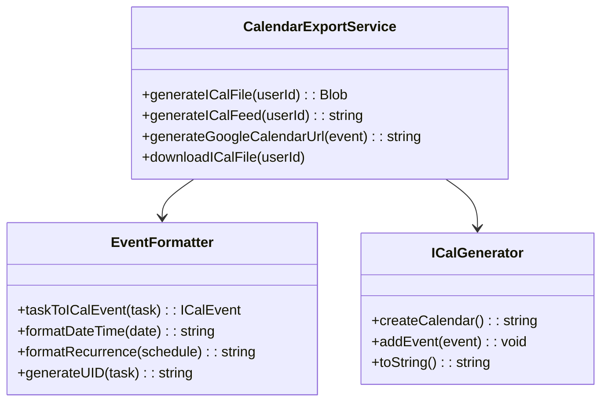
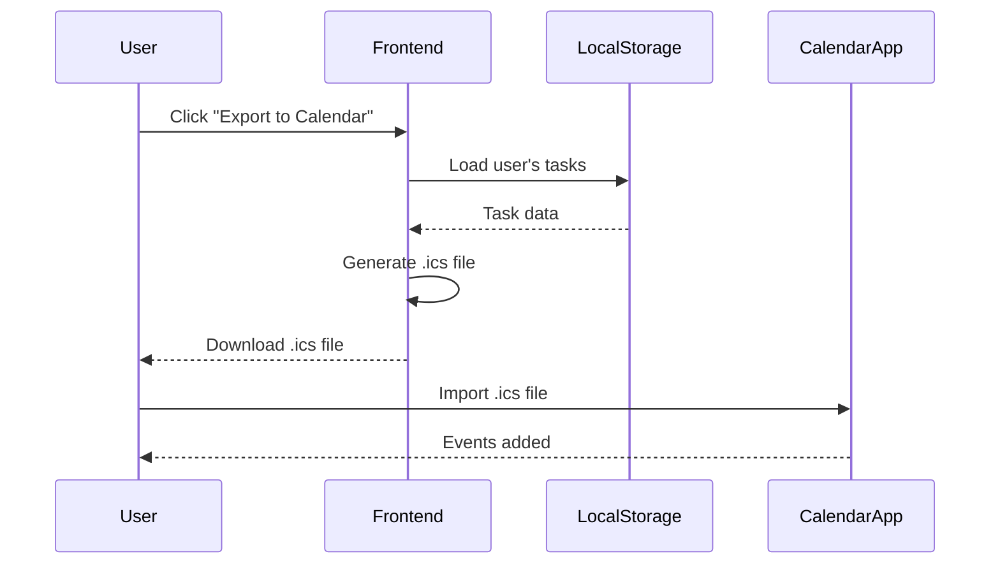
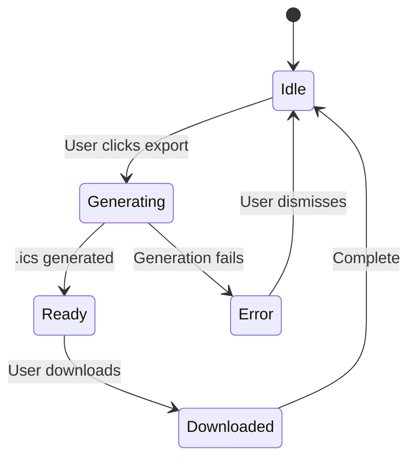

# Google Calendar Integration - Technical Specification

## 1. Background

### Problem Statement
ShareHouse members want to view their house chores and events in their personal calendars without manually copying them. The integration should be simple and require no server infrastructure.

### Context / History
- Members manually copy tasks to their calendars
- No visibility of house events in personal workflow
- Scheduling conflicts between personal and house commitments
- Different members use different calendar systems

### Stakeholders
- ShareHouse members (calendar users)
- ShareHouse admins

## 2. Motivation

### Goals & Success Stories

**User Goals:**
- "As a member, I want to export my chores to my Google Calendar"
- "As a member, I want to see when guests are arriving in my calendar"
- "As a member, I want to add house events to my calendar with one click"

**Technical Functionality:**
- Static iCal feed generation from ShareHouse data
- Direct calendar event export via `.ics` files
- Client-side Google Calendar URL generation

## 3. Scope and Approaches

### Non-Goals

| Technical Functionality | Reasoning for being off scope |
|------------------------|-------------------------------|
| Two-way sync | Static one-way export only |
| Server-side integration | Client-side only |
| OAuth/authentication | No server to store tokens |
| Real-time updates | Manual refresh required |
| Other calendar providers | Focus on Google first (iCal files work universally) |
| Calendar-based task creation | Keep task creation in app |
| Private event sync | Only house-related events |
| Historical data sync | Only sync future events |

### Value Proposition

| Technical Functionality | Value | Tradeoffs |
|------------------------|-------|-----------|
| iCal file generation | Universal compatibility | Manual refresh needed |
| Google Calendar quick-add links | One-click export | Must open each event |
| Static feed URL | Subscribable in calendar apps | Updates require re-subscription |
| Client-side only | No server costs, simple | Limited automation |

### Alternative Approaches

| Technical Functionality | Pros | Cons |
|------------------------|------|------|
| ✅ Static iCal feed | Simple, universal, no server | Manual refresh |
| OAuth server integration | Automatic sync | Requires backend, complex |
| Email invites | Works with all calendars | Spam issues, not automatic |
| Downloadable .ics files | User control, no setup | Must download for each event |

### Relevant Metrics
- Export usage rate
- File download count
- User retention after first export
- Re-export frequency

## 4. Step-by-Step Flow

### 4.1 Main ("Happy") Path - Export to Calendar

**Pre-condition:** User has ShareHouse tasks assigned

1. User navigates to "Calendar Export" section in app
2. User selects export method:
   - Option A: Download .ics file with all their chores
   - Option B: Click "Add to Google Calendar" link for individual event
   - Option C: Subscribe to their personal iCal feed URL
3. System generates calendar data from current tasks
4. User imports/subscribes in their calendar app
5. Events appear in their calendar

**Post-condition:** User's chores are visible in their calendar

### 4.2 Alternate / Error Paths

| # | Condition | System Action | Suggested Handling |
|---|-----------|---------------|-------------------|
| A1 | No future tasks | Show empty state | Display "No upcoming chores" |
| A2 | Browser blocks download | Show instructions | Guide to allow downloads |
| A3 | Calendar app not detected | Show generic instructions | Link to help docs |
| A4 | Feed URL changed | Old URL breaks | Show new URL, notify users |

## 5. UML Diagrams

### Calendar Export Architecture



### Export Flow



### Export Method State



## 6. Edge Cases and Concessions

### Edge Cases
- User has no upcoming tasks → Show friendly empty state
- Recurring chores → Generate individual events for next N occurrences
- Time zone differences → Use user's local timezone
- All-day vs. timed events → Default to all-day for chores without time
- Very long task lists → Limit to next 6 months of events

### Design Concessions
- Export limited to 6 months of future events
- Maximum 100 events per export
- Manual refresh required (no auto-sync)
- No tracking of which events were already exported
- Feed URLs must be re-generated if user ID changes
- No deletion of past events in calendar

## 7. Implementation Details

### iCal Format Structure

```
BEGIN:VCALENDAR
VERSION:2.0
PRODID:-//ShareHouse//Calendar Export//EN
CALSCALE:GREGORIAN
METHOD:PUBLISH

BEGIN:VEVENT
UID:[task-id]@sharehouse.app
DTSTAMP:[timestamp]
DTSTART:[start-date]
SUMMARY:[task-title]
DESCRIPTION:[task-description]
LOCATION:[house-address]
STATUS:CONFIRMED
SEQUENCE:0
END:VEVENT

END:VCALENDAR
```

### Google Calendar Quick-Add URL Format

```
https://calendar.google.com/calendar/render?action=TEMPLATE
  &text=[event-title]
  &dates=[start]/[end]
  &details=[description]
  &location=[location]
```

### Static Feed Generation

- Generate unique feed URL per user: `/exports/[user-id].ics`
- Regenerate file on client-side when user visits page
- Store generated feed as static file
- User can subscribe to this URL in calendar apps

## 8. Open Questions

1. ✅ Should we create a separate ShareHouse calendar or use primary? → User decides during import
2. ✅ How to handle recurring chores in calendar? → Generate individual events for next N occurrences (configurable, default 10)
3. ✅ Should completed tasks be marked in calendar? → No, only export future uncompleted tasks
4. What calendar fields to populate?
   - Summary: Task title
   - Description: Task description + assignee info
   - Location: House address (if available)
   - Attendees: None (no email invites)
5. ✅ How to handle calendar notifications vs. app notifications? → Let calendar app handle notifications (app still sends push)

## 9. Technical Implementation

### Client-Side Libraries
- `ics.js` or similar for .ics generation
- Built-in `Blob` and download APIs for file export
- URL encoding for Google Calendar links

### Data Flow
1. Frontend fetches user's tasks from blockchain/local state
2. Filter to future, uncompleted tasks only
3. Transform tasks to iCal format
4. Generate .ics file in-memory
5. Trigger browser download or provide URL

### UI Components
- "Export to Calendar" button in main navigation
- Individual "Add to Google Calendar" links on task cards
- Export settings modal (date range, recurrence count)
- Success confirmation with instructions

## 10. Glossary / References

**Terms:**
- **iCal/iCalendar:** Standard format for calendar data (.ics files)
- **VEVENT:** Individual calendar event in iCal format
- **UID:** Unique identifier for calendar event
- **PRODID:** Product identifier in iCal file
- **Static Export:** Non-dynamic, generated on-demand export

**References:**
- [iCalendar Specification (RFC 5545)](https://tools.ietf.org/html/rfc5545)
- [Google Calendar URLs](https://github.com/InteractionDesignFoundation/add-event-to-calendar-docs/blob/main/services/google.md)
- [ics.js Library](https://github.com/nwcell/ics.js/)
- [Blob API](https://developer.mozilla.org/en-US/docs/Web/API/Blob)
