# Code Duplication Issues

## Introduction

This document identifies areas where code is duplicated across the sharehouse-app codebase. Code duplication leads to maintenance overhead, potential bugs from inconsistent updates, and increased bundle size.

## Problem Statement

Multiple patterns and logic blocks are repeated throughout the codebase, particularly in:
- Transaction execution hooks
- Data fetching and mapping logic
- UI components for wallet connection
- Header navigation components

This violates the DRY (Don't Repeat Yourself) principle and makes the codebase harder to maintain.

## Architecture Overview

```mermaid
graph TD
    A[Transaction Hooks] --> B[use-create-expense.ts]
    A --> C[use-mark-expense-paid.ts]
    A --> D[use-dispute-expense.ts]
    A --> E[use-mark-chore-complete.ts]

    F[Data Fetching Hooks] --> G[use-expense-data.ts]
    F --> H[use-calendar-expenses.ts]
    F --> I[use-commune-data.ts]
    F --> J[use-calendar-chores.ts]

    K[UI Components] --> L[dashboard/page.tsx]
    K --> M[join/page.tsx]

    style B fill:#ff6b6b
    style C fill:#ff6b6b
    style D fill:#ff6b6b
    style E fill:#ff6b6b
    style G fill:#ff6b6b
    style H fill:#ff6b6b
    style I fill:#ff6b6b
    style J fill:#ff6b6b
    style L fill:#ff6b6b
    style M fill:#ff6b6b
```



## Issues Found

### 1. Duplicate Transaction Execution Code (Major)

**Location:**
- `hooks/use-create-expense.ts:47-64`
- `hooks/use-mark-expense-paid.ts:31-45`
- `hooks/use-dispute-expense.ts:39-56`
- `hooks/use-mark-chore-complete.ts:37-58`

**Description:**
All four hooks contain nearly identical transaction execution logic:
1. Encode function data using contract interface
2. Send transaction with `sendTransaction`
3. Handle gas sponsorship
4. Error handling and toast notifications
5. Data refresh after success

**Example from use-create-expense.ts:**
```typescript
const data = encodeFunctionData({
  abi: CONTRACT_ABI,
  functionName: 'createExpense',
  args: [/* ... */]
});

const hash = await sendTransaction({
  to: CONTRACT_ADDRESS,
  data,
  chain: gnosis,
  gasSponsorship: { paymasterAddress: PAYMASTER_ADDRESS }
});
```

This pattern is repeated in all transaction hooks with minor variations.

### 2. Duplicate Expense Mapping Logic (Major)

**Location:**
- `hooks/use-expense-data.ts:26-39`
- `hooks/use-calendar-expenses.ts:26-38`

**Description:**
Both hooks map raw contract data to expense objects with the same transformation logic:

```typescript
const mappedExpenses = expenses[0].map((expense: any, index: number) => ({
  id: Number(expense.id),
  creator: expense.creator,
  assignedTo: expenses[1][index],
  amount: expense.amount.toString(),
  description: expense.description,
  isPaid: expense.isPaid,
  isDisputed: expense.isDisputed,
  createdAt: Number(expense.createdAt),
  period: Number(expense.period),
}));
```

### 3. Duplicate Chore Data Fetching (Major)

**Location:**
- `hooks/use-commune-data.ts:57-72`
- `hooks/use-calendar-chores.ts:29-42`

**Description:**
Similar chore fetching and mapping logic duplicated between hooks.

### 4. Duplicate Wallet Connection UI (Minor)

**Location:**
- `app/dashboard/page.tsx:37-64`
- `app/join/page.tsx:126-136`

**Description:**
Wallet connection prompt with similar messaging duplicated across pages.

### 5. Duplicate Header Component (Minor)

**Location:**
- `app/dashboard/page.tsx:106-128`
- `app/join/page.tsx:99-115`

**Description:**
Header with logo and navigation is duplicated instead of being a shared component.

## Approaches and Tradeoffs

### Approach 1: Create Shared Transaction Hook

**Implementation:**
Create a generic `useContractTransaction` hook that handles all transaction logic:

```typescript
// hooks/use-contract-transaction.ts
export function useContractTransaction() {
  const { sendTransaction, refreshData } = useWallet();

  return async function executeTransaction({
    functionName,
    args,
    onSuccess,
    onError,
  }: TransactionParams) {
    try {
      const data = encodeFunctionData({
        abi: CONTRACT_ABI,
        functionName,
        args,
      });

      const hash = await sendTransaction({
        to: CONTRACT_ADDRESS,
        data,
        chain: gnosis,
        gasSponsorship: { paymasterAddress: PAYMASTER_ADDRESS }
      });

      await refreshData();
      onSuccess?.(hash);
      return hash;
    } catch (error) {
      onError?.(error);
      throw error;
    }
  };
}
```

**Tradeoffs:**
- ✅ Eliminates ~200 lines of duplicate code
- ✅ Centralizes transaction error handling
- ✅ Easier to maintain and test
- ❌ Slightly less flexibility for hook-specific logic
- ❌ Initial refactoring effort required

### Approach 2: Create Shared Data Mapping Utilities

**Implementation:**
Create utility functions for data transformation:

```typescript
// lib/data-mappers.ts
export function mapExpense(expense: any, assignedTo: string, index: number): Expense {
  return {
    id: Number(expense.id),
    creator: expense.creator,
    assignedTo: assignedTo,
    amount: expense.amount.toString(),
    description: expense.description,
    isPaid: expense.isPaid,
    isDisputed: expense.isDisputed,
    createdAt: Number(expense.createdAt),
    period: Number(expense.period),
  };
}

export function mapExpenses(rawData: any[]): Expense[] {
  const [expenses, assignedToList] = rawData;
  return expenses.map((expense: any, index: number) =>
    mapExpense(expense, assignedToList[index], index)
  );
}
```

**Tradeoffs:**
- ✅ Ensures consistent data transformation
- ✅ Easy to test in isolation
- ✅ Type-safe with proper interfaces
- ❌ Adds extra abstraction layer
- ❌ May need updates if contract ABI changes

### Approach 3: Create Shared UI Components

**Implementation:**
Extract shared components:

```typescript
// components/wallet-connection-guard.tsx
export function WalletConnectionGuard({
  children,
  fallback
}: {
  children: React.ReactNode;
  fallback?: React.ReactNode;
}) {
  const { isConnected } = useWallet();

  if (!isConnected) {
    return fallback || <DefaultWalletPrompt />;
  }

  return <>{children}</>;
}

// components/app-header.tsx
export function AppHeader() {
  return (
    <header className="flex justify-between items-center mb-8">
      <div className="flex items-center gap-4">
        <div className="w-10 h-10 bg-sage rounded-lg" />
        <h1 className="text-2xl font-bold text-charcoal">ShareHouse</h1>
      </div>
      <div className="flex items-center gap-4">
        <LanguageToggle />
        <WalletConnectButton />
      </div>
    </header>
  );
}
```

**Tradeoffs:**
- ✅ DRY principle applied
- ✅ Consistent UI across pages
- ✅ Easier to update branding/styling
- ✅ Reduced bundle size
- ❌ Less flexibility per page
- ❌ May require props for customization

### Approach 4: Hybrid Approach (Recommended)

Combine all three approaches:
1. Create `useContractTransaction` for all transaction hooks
2. Create data mapping utilities for expense/chore transformation
3. Extract shared UI components

**Tradeoffs:**
- ✅ Maximum code reuse
- ✅ Better maintainability
- ✅ Consistent patterns throughout app
- ✅ Smaller bundle size
- ❌ Largest initial refactoring effort
- ❌ Requires careful planning to avoid over-abstraction

## Implementation Priority

1. **High Priority:** Create shared transaction hook (affects 4 hooks, ~200 lines)
2. **Medium Priority:** Create data mapping utilities (affects 4 hooks, ~100 lines)
3. **Low Priority:** Extract UI components (affects 2 pages, minor impact)

## Estimated Impact

- **Lines of code reduced:** ~400-500 lines
- **Bundle size reduction:** ~5-10 KB (minified)
- **Maintenance effort reduction:** ~30% for transaction-related code
- **Test coverage improvement:** Easier to test centralized logic
