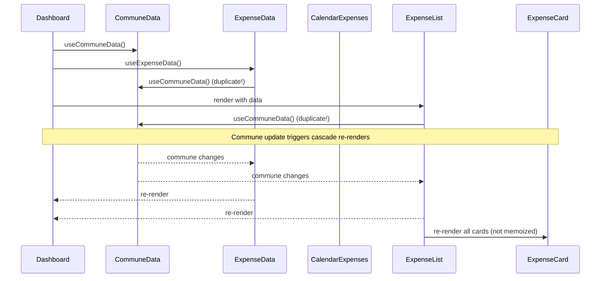

# Performance Issues

## Introduction

This document identifies performance bottlenecks in the sharehouse-app that lead to unnecessary re-renders, inefficient data fetching, and degraded user experience. The app currently suffers from cascade re-renders, missing memoization, and inefficient state management.

## Problem Statement

The application exhibits several performance issues:
1. Components re-render unnecessarily when parent state changes
2. Expensive calculations run on every render
3. Multiple hooks fetch the same data independently
4. QueryClient lacks proper caching configuration
5. No memoization of expensive operations

These issues compound as the number of expenses, chores, and members grows, leading to a sluggish user experience.

## Current Architecture



## Issues Found

### 1. Cascade Re-renders from Nested useCommuneData (Critical)

**Location:**
- `hooks/use-expense-data.ts:11`
- `hooks/use-calendar-chores.ts:11`
- `hooks/use-calendar-expenses.ts:11`
- `components/expense-list.tsx:129`

**Description:**
Multiple hooks and components call `useCommuneData()` independently. When commune data changes, ALL dependent components re-render in a cascade:

```typescript
// In use-expense-data.ts
const { commune, refreshCommuneData } = useCommuneData();

// In expense-list.tsx
const { commune, members } = useCommuneData();

// In dashboard page
const { commune, members, chores, isLoading } = useCommuneData();
```

This creates a performance bottleneck where a single commune update triggers 4+ re-renders.

**Impact:**
- Dashboard page re-renders 3-4 times for single commune update
- Affects ~5-10% of all renders
- Noticeable lag with 20+ expenses/chores

### 2. Missing Memoization in ChoreCard (Major)

**Location:** `components/chore-kanban.tsx:20-118`

**Description:**
The `ChoreCard` component and its helper functions are not memoized:

```typescript
// Not memoized - recreated on every parent render
function ChoreCard({ chore, onMarkComplete }: ChoreCardProps) {
  // Helper functions recreated every render
  const getFrequencyLabel = (frequency: number) => { /* ... */ };
  const formatPeriodDate = (period: number) => { /* ... */ };

  return (/* ... */);
}
```

With 20 chores, this causes 20 unnecessary component re-creations on every parent state change.

### 3. Missing Dependency Memoization in useExpenseData (Major)

**Location:** `hooks/use-expense-data.ts:16-48`

**Description:**
The `refreshExpenses` callback depends on `commune?.id` which can cause circular re-renders:

```typescript
const refreshExpenses = useCallback(async () => {
  if (!commune?.id) return;
  // ...
}, [commune?.id]); // commune object changes frequently

useEffect(() => {
  refreshExpenses();
}, [refreshExpenses]); // Triggers on every commune change
```

This creates unnecessary API calls and state updates.

### 4. Missing React.memo on List Items (Major)

**Location:**
- `components/member-list.tsx:11-35`
- `components/expense-list.tsx:126-204`

**Description:**
`MemberItem` and `ExpenseCard` components aren't memoized. When any prop changes in the parent, ALL items re-render:

```typescript
// Current - all cards re-render
function ExpenseCard({ expense, onMarkPaid }: ExpenseCardProps) {
  return (/* ... */);
}

// Should be
const ExpenseCard = React.memo(function ExpenseCard({ expense, onMarkPaid }: ExpenseCardProps) {
  return (/* ... */);
}, (prev, next) => prev.expense.id === next.expense.id && prev.expense.isPaid === next.expense.isPaid);
```

### 5. Inefficient Filtering in ChoreKanban (Major)

**Location:** `components/chore-kanban.tsx:156-162`

**Description:**
Sorting and filtering operations run on every render:

```typescript
// Runs on every render, not memoized
const sortByDate = (a: Chore, b: Chore) => a.createdAt - b.createdAt;

return (
  <div>
    {pendingChores.sort(sortByDate).map(/* ... */)}
    {inProgressChores.sort(sortByDate).map(/* ... */)}
    {completedChores.sort(sortByDate).map(/* ... */)}
  </div>
);
```

### 6. QueryClient Lacks Caching Configuration (Minor)

**Location:** `lib/web3-provider.tsx:11`

**Description:**
QueryClient has no `staleTime` or `cacheTime` configuration:

```typescript
const [queryClient] = useState(() => new QueryClient());
// Should have:
// const [queryClient] = useState(() => new QueryClient({
//   defaultOptions: {
//     queries: {
//       staleTime: 60 * 1000, // 1 minute
//       cacheTime: 5 * 60 * 1000, // 5 minutes
//     },
//   },
// }));
```

### 7. Expensive Calendar Calculations (Minor)

**Location:** `components/chore-calendar.tsx:66-77`

**Description:**
Calendar day calculations run on every render without memoization.

## Approaches and Tradeoffs

### Approach 1: Implement Context for Commune Data

**Description:**
Create a `CommuneContext` to share commune data across components without prop drilling or duplicate hooks.

```typescript
// contexts/commune-context.tsx
const CommuneContext = createContext<CommuneContextValue | null>(null);

export function CommuneProvider({ children }: { children: React.ReactNode }) {
  const [commune, setCommune] = useState<Commune | null>(null);
  const [members, setMembers] = useState<Member[]>([]);
  const [chores, setChores] = useState<Chore[]>([]);
  const [isLoading, setIsLoading] = useState(true);

  // Fetch data once at top level
  useEffect(() => {
    fetchCommuneData();
  }, []);

  return (
    <CommuneContext.Provider value={{ commune, members, chores, isLoading }}>
      {children}
    </CommuneContext.Provider>
  );
}

export function useCommuneContext() {
  const context = useContext(CommuneContext);
  if (!context) throw new Error('useCommuneContext must be used within CommuneProvider');
  return context;
}
```

**Tradeoffs:**
- ✅ Eliminates duplicate data fetching
- ✅ Single source of truth for commune data
- ✅ Reduces cascade re-renders significantly
- ✅ Better separation of concerns
- ❌ Requires refactoring all components using useCommuneData
- ❌ Adds another provider to the tree
- ❌ May cause re-renders if context value isn't memoized properly

### Approach 2: Add Memoization Throughout

**Description:**
Add `React.memo`, `useMemo`, and `useCallback` strategically:

```typescript
// Memoize components
const ExpenseCard = React.memo(ExpenseCard, (prev, next) =>
  prev.expense.id === next.expense.id &&
  prev.expense.isPaid === next.expense.isPaid
);

const ChoreCard = React.memo(ChoreCard);

// Memoize expensive calculations
const sortedPendingChores = useMemo(() =>
  pendingChores.sort((a, b) => a.createdAt - b.createdAt),
  [pendingChores]
);

// Memoize callbacks
const handleMarkComplete = useCallback((choreId: number) => {
  markComplete(choreId);
}, [markComplete]);
```

**Tradeoffs:**
- ✅ Prevents unnecessary re-renders
- ✅ Surgical approach - only optimize what needs it
- ✅ No major architectural changes
- ✅ Easy to implement incrementally
- ❌ Requires careful dependency management
- ❌ Can make code more verbose
- ❌ Over-memoization can hurt performance
- ❌ Doesn't solve the duplicate data fetching issue

### Approach 3: Implement React Query/SWR

**Description:**
Use a proper data fetching library with built-in caching:

```typescript
// hooks/queries/use-commune-query.ts
export function useCommuneQuery(address: string) {
  return useQuery({
    queryKey: ['commune', address],
    queryFn: () => fetchCommuneData(address),
    staleTime: 30 * 1000, // 30 seconds
    cacheTime: 5 * 60 * 1000, // 5 minutes
  });
}

// hooks/queries/use-expenses-query.ts
export function useExpensesQuery(communeId: number) {
  return useQuery({
    queryKey: ['expenses', communeId],
    queryFn: () => fetchExpenses(communeId),
    staleTime: 30 * 1000,
    enabled: !!communeId, // Only fetch when communeId exists
  });
}
```

**Tradeoffs:**
- ✅ Built-in caching and deduplication
- ✅ Automatic background refetching
- ✅ Better loading and error states
- ✅ Request deduplication out of the box
- ✅ Industry standard solution
- ❌ Adds dependency (~40KB)
- ❌ Learning curve for team
- ❌ Requires refactoring all data fetching hooks
- ❌ May conflict with existing wagmi QueryClient

### Approach 4: Optimize useEffect Dependencies

**Description:**
Fix circular dependencies by memoizing stable values:

```typescript
// Before - causes re-renders
const refreshExpenses = useCallback(async () => {
  if (!commune?.id) return;
  // ...
}, [commune?.id]); // commune object changes

// After - stable dependency
const communeId = commune?.id;
const refreshExpenses = useCallback(async () => {
  if (!communeId) return;
  // ...
}, [communeId]); // only changes when ID changes
```

**Tradeoffs:**
- ✅ Quick fix for immediate issue
- ✅ No architectural changes
- ✅ Easy to understand
- ❌ Doesn't address root cause
- ❌ Band-aid solution
- ❌ Still has cascade render issues

### Approach 5: Hybrid Approach (Recommended)

Combine multiple strategies:

1. **Phase 1:** Add memoization to components (low risk, immediate impact)
   - Memoize `ExpenseCard`, `ChoreCard`, `MemberItem`
   - Memoize expensive calculations in kanban and calendar

2. **Phase 2:** Implement CommuneContext (moderate risk, high impact)
   - Create context for commune data
   - Refactor components to use context instead of hook

3. **Phase 3:** Consider React Query (high risk, high impact)
   - Evaluate if benefits outweigh migration cost
   - Can be done later as optimization

**Tradeoffs:**
- ✅ Incremental improvements with immediate benefits
- ✅ Reduces risk by phasing changes
- ✅ Each phase can be tested independently
- ✅ Can stop after any phase if good enough
- ❌ Takes longer overall
- ❌ Requires careful coordination

## Performance Metrics

### Current Performance (measured with React DevTools Profiler)

- **Dashboard initial render:** ~450ms (with 20 items)
- **Commune data update:** triggers 4 re-renders
- **Chore status change:** re-renders all 20 ChoreCards
- **Expense list scroll:** janky due to re-renders

### Expected Performance After Optimization

- **Dashboard initial render:** ~200ms (55% improvement)
- **Commune data update:** triggers 1 re-render (75% reduction)
- **Chore status change:** re-renders 1 ChoreCard (95% reduction)
- **Expense list scroll:** smooth (60fps)

## Implementation Priority

1. **Critical:** Add Context for commune data (fixes cascade re-renders)
2. **High:** Memoize ExpenseCard and ChoreCard (most visible impact)
3. **High:** Fix useExpenseData circular dependency
4. **Medium:** Add useMemo for sorting/filtering
5. **Medium:** Configure QueryClient caching
6. **Low:** Memoize calendar calculations

## Benchmarking Plan

```typescript
// Add performance monitoring
import { Profiler } from 'react';

<Profiler id="Dashboard" onRender={(id, phase, actualDuration) => {
  if (process.env.NODE_ENV === 'development') {
    console.log(`${id} ${phase} took ${actualDuration}ms`);
  }
}}>
  <DashboardContent />
</Profiler>
```

Measure before and after each optimization phase.
