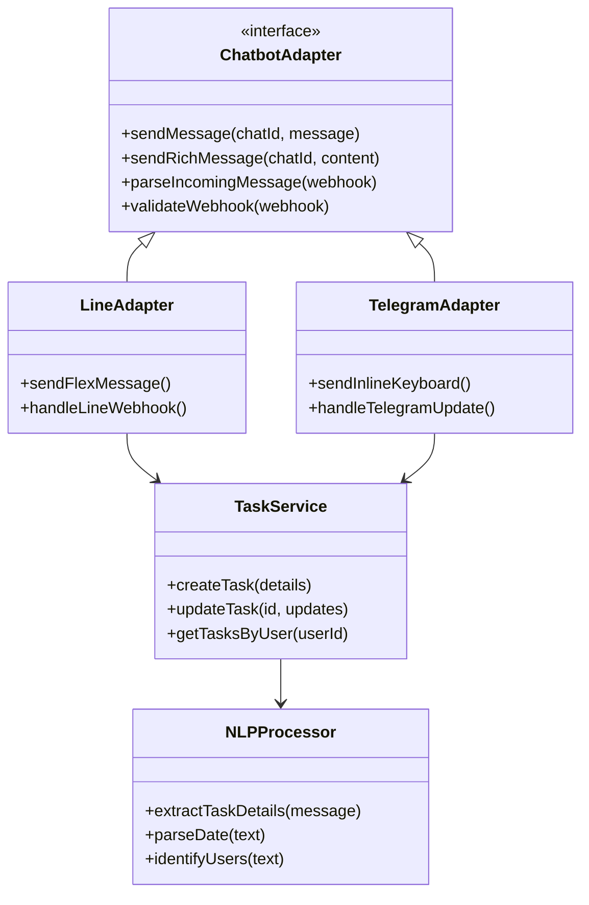
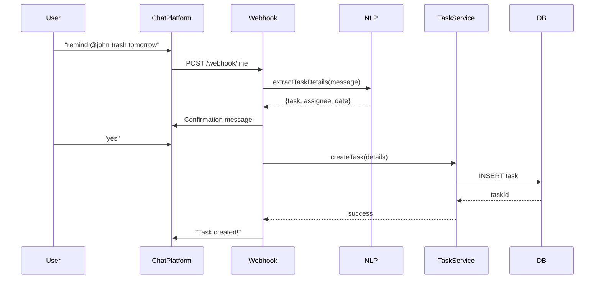
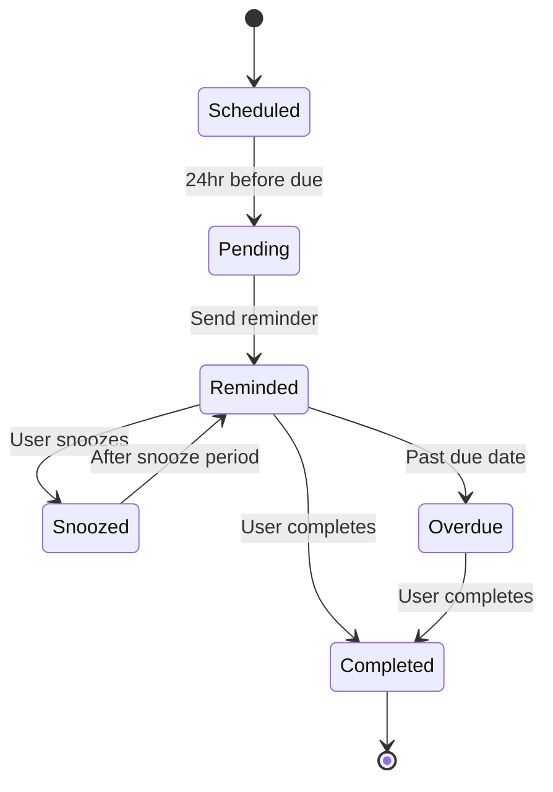

# Chatbot Integration for Task Management and Reminders - Technical Specification
 
## 1. Background
 
### Problem Statement
ShareHouse members currently need to manually check the app for task assignments, reminders, and updates. This creates friction in task management and reduces engagement with the platform. Members miss important deadlines and updates because they don't regularly open the app.
 
### Context / History
- Most sharehouses already use group chat platforms (LINE, WhatsApp, Telegram) for daily communication
- Current system requires members to switch between chat app and ShareHouse app
- No automated reminders or notifications outside the app
 
### Stakeholders
- ShareHouse members (primary users)
- ShareHouse creators/admins
- External chat platforms (LINE, Telegram, Discord, Slack, WhatsApp)
- Backend notification service
 
## 2. Motivation
 
### Goals & Success Stories
 
**User Goals:**
- "As a sharehouse member, I want to create tasks from my group chat without opening the app"
- "As a sharehouse member, I want to receive reminders about my chores in the group chat"
- "As a sharehouse admin, I want the bot to automatically notify members of overdue tasks"
 
**Technical Functionality:**
- Bidirectional sync between chat platforms and ShareHouse app
- Natural language processing for task creation
- Automated reminder system
- Platform-agnostic architecture
 
## 3. Scope and Approaches
 
### Non-Goals
 
| Technical Functionality | Reasoning for being off scope |
|------------------------|-------------------------------|
| Voice/Video chat integration | Focus on text-based task management |
| Direct messaging between users | Keep focus on group communications |
| AI-powered task assignment | Manual assignment maintains accountability |
| Real-time chat replacement | ShareHouse is not a chat app |
 
### Value Proposition
 
| Technical Functionality | Value | Tradeoffs |
|------------------------|-------|-----------|
| Natural Language Processing | Easy task creation without learning commands | Potential misinterpretation of intent |
| Multi-platform support | Works with existing chat apps | Complexity in maintaining multiple adapters |
| Automated reminders | Improved task completion rates | Potential notification fatigue |
| Interactive buttons | Quick actions without typing | Platform-specific implementations needed |
 
### Alternative Approaches
 
| Technical Functionality | Pros | Cons |
|------------------------|------|------|
| Push notifications only | Simpler implementation | Users still need to open app |
| Email reminders | Universal support | Lower engagement than chat |
| SMS notifications | High deliverability | Cost per message |
| In-app messaging only | Full control over UX | Requires app to be open |
 
### Relevant Metrics
- Task creation rate via chatbot
- Task completion rate after reminders
- Response time to bot commands
- User engagement with interactive messages
 
## 4. Step-by-Step Flow
 
### 4.1 Main ("Happy") Path - Task Creation via Chat
 
**Pre-condition:** User is authenticated and sharehouse is connected to chat platform
 
1. User sends message: "Bot remind @john to take out trash tomorrow"
2. Bot validates:
   - User is member of sharehouse
   - @john is valid member
   - "tomorrow" is parseable date
3. Bot creates confirmation message with parsed details
4. User confirms with "yes"
5. System creates task in database
6. Bot sends success message with task details
 
**Post-condition:** Task is created and assigned to @john with due date
 
### 4.2 Alternate / Error Paths
 
| # | Condition | System Action | Suggested Handling |
|---|-----------|---------------|-------------------|
| A1 | Unknown user mentioned | Return error message | Suggest available users |
| A2 | Invalid date format | Request clarification | Show date format examples |
| A3 | No sharehouse connected | 403 Forbidden | Prompt admin to connect chat |
| A4 | Rate limit exceeded | 429 Too Many Requests | Queue for later processing |
| A5 | Chat platform API down | 503 Service Unavailable | Retry with exponential backoff |
 
## 5. UML Diagrams
 
### System Architecture
 

 
### Task Creation Flow
 

 
### Reminder State Machine
 

 
## 5. Edge Cases and Concessions
 
### Edge Cases
- Multiple users with similar names (@john vs @johnny)
- Timezone differences between chat platform and app
- Message ordering during high volume
- Handling edited/deleted messages
- Bot removed from group chat
 
### Design Concessions
- Initial version will only support English
- Complex recurring tasks must be created in app
- File attachments (images, documents) not supported initially
- Maximum 100 tasks per day per sharehouse to prevent spam
 
## 6. Open Questions
 
1. Should the bot have a personality/tone or remain neutral?
2. How to handle privacy when bot has access to all group messages?
3. Should we implement end-to-end encryption for sensitive data?
4. What's the fallback when NLP fails to parse a message?
5. How to authenticate users across different chat platforms?
 
## 7. Glossary / References
 
**Terms:**
- **Adapter:** Platform-specific implementation of chat integration
- **Webhook:** HTTP endpoint that receives messages from chat platforms
- **NLP:** Natural Language Processing for understanding user intent
- **Rich Message:** Platform-specific interactive message format
- **Flex Message:** LINE's flexible message template system
- **Inline Keyboard:** Telegram's interactive button system
 
**References:**
- [LINE Messaging API Documentation](https://developers.line.biz/en/docs/messaging-api/)
- [Telegram Bot API](https://core.telegram.org/bots/api)
- [Discord Developer Portal](https://discord.com/developers/docs)
- [Slack API Documentation](https://api.slack.com/)
- [WhatsApp Business API](https://developers.facebook.com/docs/whatsapp)