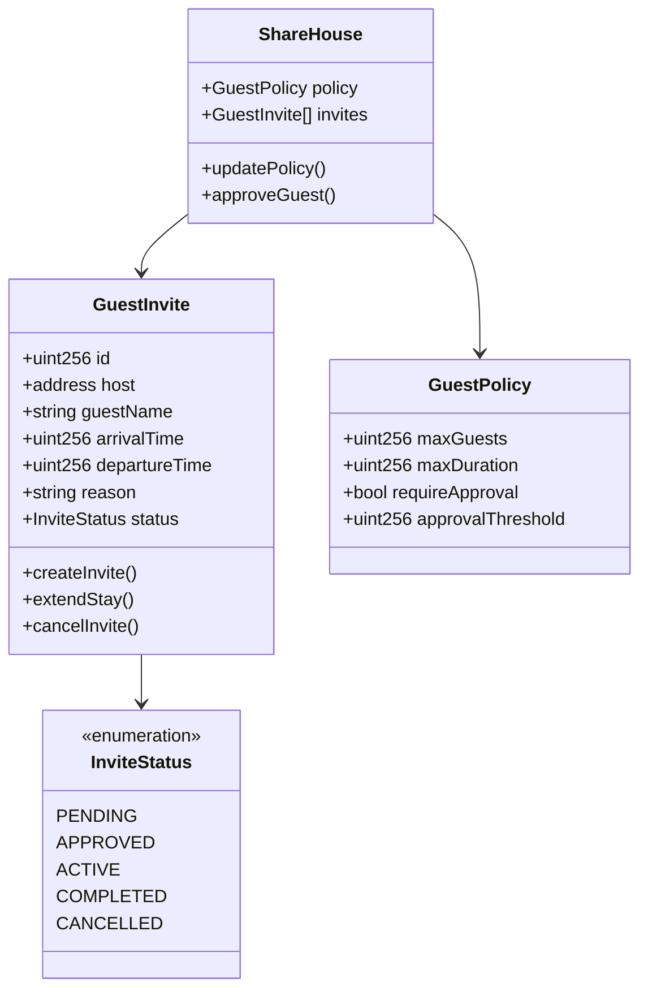
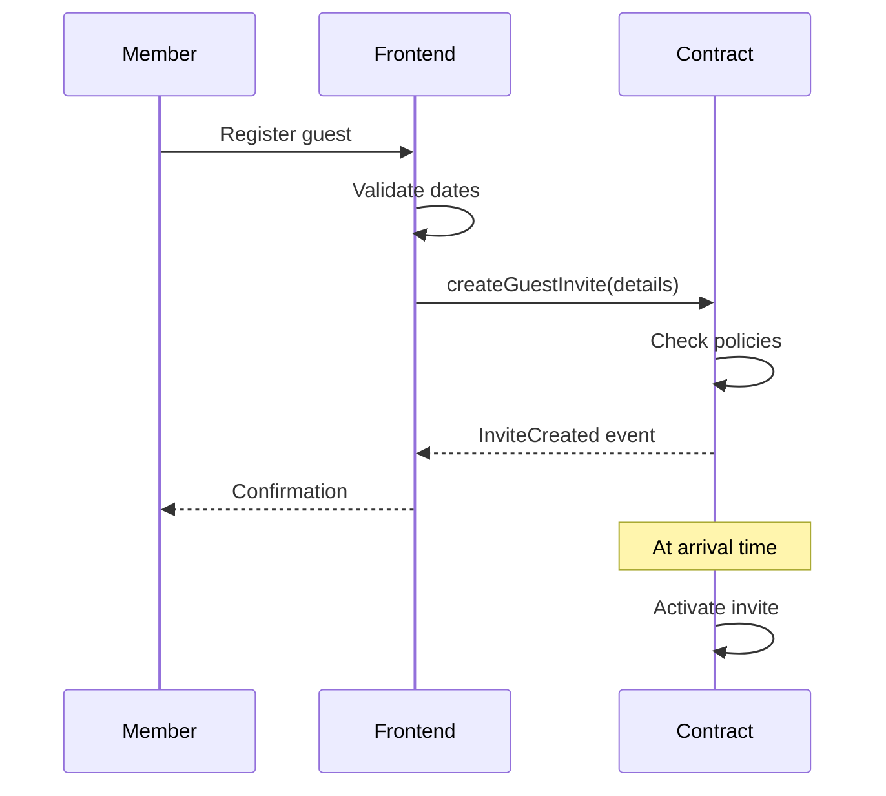
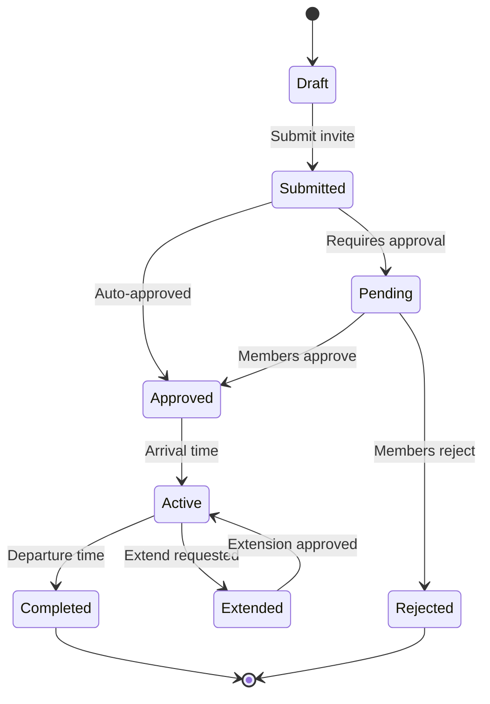

# Guest Invite Feature - Technical Specification

## 1. Background

### Problem Statement
ShareHouse members cannot properly track and manage guest visits. There's no system to notify housemates about incoming guests, their arrival/departure times, or house rules for visitors. This leads to surprises, security concerns, and conflicts about guest policies.

### Context / History
- Members bring guests without notifying others
- No record of who invited which guests
- No way to track guest stay duration
- Security concerns about unknown visitors
- Conflicts about overnight guests

### Stakeholders
- ShareHouse members (hosts)
- Guests/visitors
- ShareHouse creator/admin
- Smart contract system

## 2. Motivation

### Goals & Success Stories

**User Goals:**
- "As a member, I want to notify housemates when I'm having guests"
- "As a house, we want to track who's visiting and when"
- "As an admin, I want to enforce guest policies"
- "As a member, I want to know when guests are arriving"

**Technical Functionality:**
- On-chain guest registration
- Arrival/departure timestamps
- Guest approval workflow

## 3. Scope and Approaches

### Non-Goals

| Technical Functionality | Reasoning for being off scope |
|------------------------|-------------------------------|
| Guest identity verification | Privacy concerns |
| Guest payment system | Complexity for MVP |
| Guest access control (physical) | Requires hardware integration |
| Historical guest analytics | Focus on current tracking |
| Notification system | Deferred for later implementation |

### Value Proposition

| Technical Functionality | Value | Tradeoffs |
|------------------------|-------|-----------|
| On-chain guest records | Transparent, tamper-proof | Gas costs |
| Time-bound invites | Clear expectations | Requires active management |
| Approval workflow | Democratic decision making | Slower process |

### Alternative Approaches

| Technical Functionality | Pros | Cons |
|------------------------|------|------|
| Off-chain guest log | No gas costs | No enforcement mechanism |
| Calendar-only tracking | Simple | No smart contract integration |
| Honor system | No technology needed | No accountability |
| Physical guest book | Traditional approach | Not connected to app |

### Relevant Metrics
- Average guest registration time
- Guest policy compliance rate
- Number of guest disputes
- Guest stay duration accuracy
- Member satisfaction with guest system

## 4. Step-by-Step Flow

### 4.1 Main ("Happy") Path - Register Guest Visit

**Pre-condition:** Member is authenticated and part of sharehouse

1. Member initiates guest registration
2. Member provides:
   - Guest name/identifier
   - Arrival date/time
   - Departure date/time
   - Reason for visit
3. System validates:
   - Member has guest privileges
   - Dates are valid
   - No policy violations
4. System creates guest record on-chain
5. Other members can view guest details
6. Guest period expires automatically

**Post-condition:** Guest visit recorded and visible to all members

### 4.2 Alternate / Error Paths

| # | Condition | System Action | Suggested Handling |
|---|-----------|---------------|-------------------|
| A1 | Guest limit exceeded | Reject registration | Show current limit |
| A2 | Overlapping guests | Show warning | Allow with confirmation |
| A3 | Past arrival date | Prevent submission | Require future date |
| A4 | Member not authorized | Block action | Contact admin |
| A5 | Extended stay requested | Require approval | Vote mechanism |

## 5. UML Diagrams

### Guest Management System

### Guest Registration Flow

### Guest Invite State Machine

## 5. Edge Cases and Concessions

### Edge Cases
- Guest arrives early/late
- Guest overstays without notice
- Emergency guest situations
- Multiple guests from same member
- Guest during member absence

### Design Concessions
- No guest identity verification (privacy)
- Maximum 30-day guest duration
- No retroactive guest registration
- Simple approval (no complex voting)
- No integration with physical access systems
- No notification system (deferred)

## 6. Open Questions

1. Should guests have temporary app access?
2. How to handle recurring guests?
3. Should there be a house-wide guest calendar?
4. Can guests be transferred between hosts?
5. How to handle guest emergencies?

## 7. Glossary / References

**Terms:**
- **Guest Invite:** On-chain record of planned guest visit
- **Host:** ShareHouse member responsible for guest
- **Guest Policy:** House rules regarding visitors
- **Approval Threshold:** Percentage of members needed to approve

**References:**
- [Smart Contract Events](https://docs.soliditylang.org/en/v0.8.0/contracts.html#events)
- [Time-based Smart Contracts](https://docs.openzeppelin.com/contracts/4.x/api/utils#TimelockController)
- [Access Control Patterns](https://docs.openzeppelin.com/contracts/4.x/access-control)
