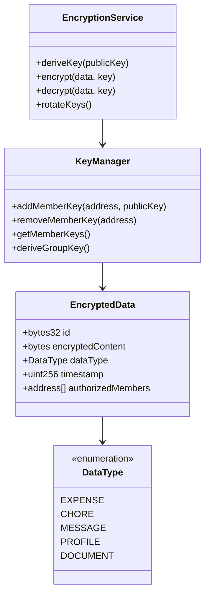
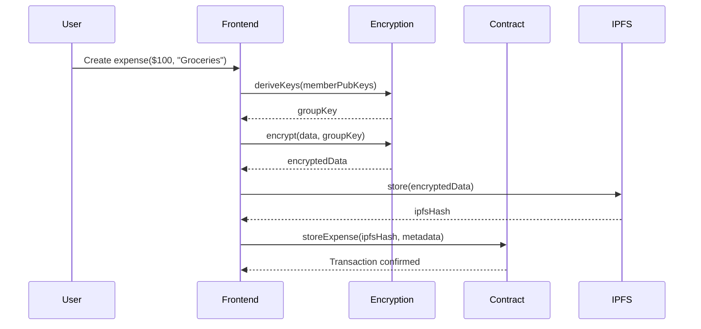
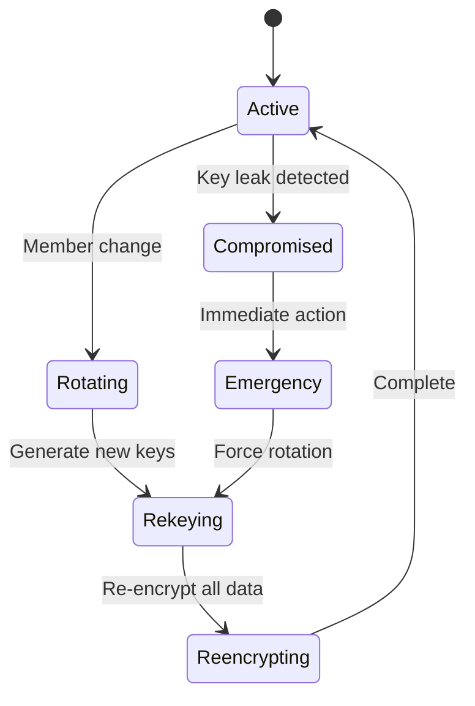

# ShareHouse Data Encryption System - Technical Specification

## 1. Background

### Problem Statement
ShareHouse data (expenses, chores, messages, personal information) is currently stored in plain text on the blockchain, creating privacy concerns. Members' financial information, schedules, and personal habits are publicly visible to anyone examining the blockchain.

### Context / History
- All sharehouse data is currently unencrypted on-chain
- Members concerned about privacy of expense amounts and descriptions
- Chore assignments reveal personal schedules
- Message board content is permanently public
- No way to comply with privacy regulations (GDPR, etc.)

### Stakeholders
- ShareHouse members (data owners)
- ShareHouse admins
- Smart contract system
- Regulatory compliance teams
- External auditors

## 2. Motivation

### Goals & Success Stories

**User Goals:**
- "As a member, I want my expense data to be private from non-members"
- "As a sharehouse, we want internal communications to remain confidential"
- "As an admin, I want to protect member privacy while maintaining transparency"

**Technical Functionality:**
- End-to-end encryption for sensitive data
- Key management using ECDSA public keys
- Selective decryption for authorized members
- Zero-knowledge proofs for validation without revealing data

## 3. Scope and Approaches

### Non-Goals

| Technical Functionality | Reasoning for being off scope |
|------------------------|-------------------------------|
| Homomorphic encryption | Too computationally expensive for mobile |
| Multi-party computation | Complexity outweighs benefits |
| Off-chain storage encryption only | Need on-chain privacy too |
| Encrypted smart contract logic | Focus on data encryption first |

### Value Proposition

| Technical Functionality | Value | Tradeoffs |
|------------------------|-------|-----------|
| ECIES encryption | Privacy for all sharehouse data | Gas costs increase |
| Key derivation from wallet | No additional key management | Wallet compromise affects encryption |
| Selective encryption | Balance privacy and transparency | Configuration complexity |
| Member-based access control | Data stays private to house | Key rotation on member changes |

### Alternative Approaches

| Technical Functionality | Pros | Cons |
|------------------------|------|------|
| Off-chain storage only | Lower gas costs | Trust in centralized storage |
| Symmetric encryption | Simpler implementation | Key distribution problem |
| No encryption | Simplest, cheapest | No privacy |
| Hybrid on/off chain | Balance cost and privacy | Increased complexity |

### Relevant Metrics
- Encryption/decryption performance (ms)
- Additional gas costs per transaction
- Key rotation frequency
- Data breach incidents
- Decryption failure rate

## 4. Step-by-Step Flow

### 4.1 Main ("Happy") Path - Creating Encrypted Expense

**Pre-condition:** Member has wallet connected and is part of sharehouse

1. Member creates expense with amount and description
2. Frontend derives encryption keys from member wallets
3. System encrypts data using sharehouse public key
4. Encrypted data is submitted to smart contract
5. Smart contract stores encrypted blob and metadata
6. Other members fetch and decrypt using their keys
7. Decrypted data displayed in frontend

**Post-condition:** Expense stored encrypted, viewable only by members

### 4.2 Alternate / Error Paths

| # | Condition | System Action | Suggested Handling |
|---|-----------|---------------|-------------------|
| A1 | Member wallet unavailable | Cannot encrypt | Store locally, encrypt later |
| A2 | Decryption fails | Show error | Request re-encryption |
| A3 | New member added | Re-encrypt all data | Batch process off-peak |
| A4 | Member removed | Rotate keys | Immediate key rotation |
| A5 | Key compromise detected | Emergency rotation | Notify all members |

## 5. UML Diagrams

### Encryption Architecture

### Encryption Flow

### Key Rotation State Machine

## 5. Edge Cases and Concessions

### Edge Cases
- Member loses access to wallet
- Partial decryption of batch data
- Encryption during smart contract upgrade
- Cross-device key synchronization
- Handling large files (images, documents)

### Design Concessions
- Initial version encrypts only new data (not retroactive)
- Group key shared among all members (not individual encryption)
- Performance impact accepted for privacy benefit
- Cannot search encrypted data without decrypting
- Emergency recovery requires majority member approval

## 6. Open Questions

1. Should we use threshold encryption for admin actions?
2. How to handle data export for leaving members?
3. Should encryption be mandatory or optional per sharehouse?
4. How to audit encrypted data for compliance?
5. Backup key recovery mechanism?

## 7. Glossary / References

**Terms:**
- **ECIES:** Elliptic Curve Integrated Encryption Scheme
- **Key Derivation:** Generating encryption keys from ECDSA keys
- **Group Key:** Shared key for all sharehouse members
- **Zero-Knowledge Proof:** Prove data validity without revealing it
- **Key Rotation:** Changing encryption keys periodically

**References:**
- [ECIES Specification](https://en.wikipedia.org/wiki/Integrated_Encryption_Scheme)
- [Ethereum ECIES Implementation](https://github.com/ethereum/py-evm/blob/master/eth/tools/ecies.py)
- [NuCypher Proxy Re-encryption](https://www.nucypher.com/)
- [IPFS Encryption](https://docs.ipfs.io/concepts/privacy-and-encryption/)