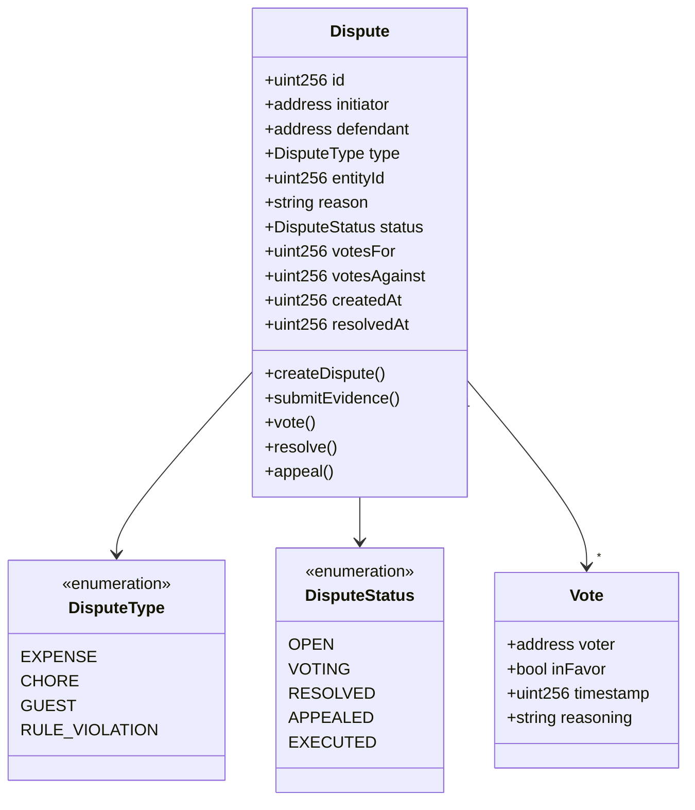
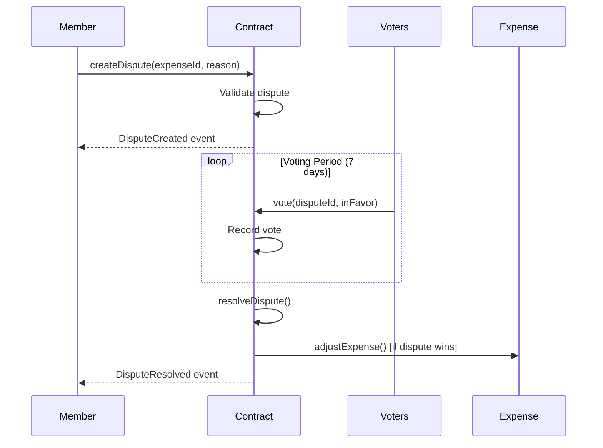
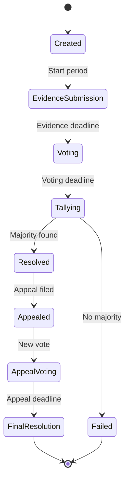

# Dispute Resolution System - Technical Specification

## 1. Background

### Problem Statement
ShareHouse members lack a transparent, fair mechanism to resolve conflicts about expenses, chores, and house rules. Current disputes are handled informally through chat or in-person arguments, leading to unresolved tensions and members leaving sharehouses.

### Context / History
- Disputes commonly arise from expense disagreements, incomplete chores, and rule violations
- No formal record of disputes or resolutions
- No accountability or enforcement mechanism
- Previous attempts relied on house meetings which often don't happen

### Stakeholders
- ShareHouse members (disputing parties)
- ShareHouse creator/admin
- Smart contract system
- Other house members (voters)

## 2. Motivation

### Goals & Success Stories

**User Goals:**
- "As a member, I want to formally dispute an unfair expense charge"
- "As a house, we want democratic resolution of conflicts"
- "As an admin, I want transparent records of all disputes and outcomes"

**Technical Functionality:**
- On-chain tamper-proof dispute records
- Democratic voting mechanism
- Automated resolution execution
- Appeal process for fairness

## 3. Scope and Approaches

### Non-Goals

| Technical Functionality | Reasoning for being off scope |
|------------------------|-------------------------------|
| Legal arbitration | Not a legal platform |
| Financial compensation beyond expenses | Keep scope to house matters |
| External mediator involvement | Maintain house autonomy |
| Anonymous disputes | Transparency is key for trust |

### Value Proposition

| Technical Functionality | Value | Tradeoffs |
|------------------------|-------|-----------|
| On-chain records | Tamper-proof history | Gas costs for operations |
| Democratic voting | Fair resolution | Potential for bias/coalitions |
| Automated execution | Removes human enforcement burden | Smart contract complexity |
| Appeal mechanism | Second chance for fairness | Prolongs resolution time |

### Alternative Approaches

| Technical Functionality | Pros | Cons |
|------------------------|------|------|
| Off-chain arbitration | No gas costs | No enforcement mechanism |
| Admin-only decisions | Quick resolution | Potential for abuse of power |
| Third-party mediator | Professional handling | Additional cost and complexity |
| Reputation system only | Social pressure | No concrete enforcement |

### Relevant Metrics
- Average dispute resolution time
- Percentage of disputes appealed
- Member satisfaction with outcomes
- Dispute frequency per sharehouse

## 4. Step-by-Step Flow

### 4.1 Main ("Happy") Path - Expense Dispute Resolution

**Pre-condition:** Member believes an expense assignment is incorrect

1. Member initiates dispute against expense ID with reason
2. System validates:
   - Member is part of sharehouse
   - Expense exists and involves member
   - No existing dispute for same expense
3. System creates dispute with 7-day voting period
4. Defendant provides counter-evidence
5. House members vote (excluding involved parties)
6. After voting period, system tallies votes
7. If dispute wins (>50% votes), expense is reassigned/adjusted
8. System executes resolution automatically

**Post-condition:** Expense is adjusted according to vote outcome

### 4.2 Alternate / Error Paths

| # | Condition | System Action | Suggested Handling |
|---|-----------|---------------|-------------------|
| A1 | Insufficient voters | Extend voting period | Notify all members |
| A2 | Tie vote | Dispute fails | Status quo maintained |
| A3 | Member leaves during dispute | Continue with remaining | Adjust quorum |
| A4 | Appeal requested | Start appeal process | One appeal allowed |
| A5 | Smart contract paused | Queue for later | Admin notification |

## 5. UML Diagrams

### Dispute Data Model

### Dispute Resolution Flow

### Dispute State Machine

## 5. Edge Cases and Concessions

### Edge Cases
- Member creates multiple disputes for same issue
- Dispute created just before member removal
- Smart contract upgrade during active dispute
- Voting manipulation through temporary members
- Dispute about the dispute system itself

### Design Concessions
- Maximum one appeal per dispute to prevent infinite loops
- Simple majority (>50%) rather than complex voting weights
- 7-day fixed voting period (not configurable initially)
- No anonymous voting to ensure accountability
- Cannot dispute disputes older than 30 days

## 6. Open Questions

1. Should voting power be weighted by tenure or stake?
2. How to handle disputes when house has only 2-3 members?
3. Should there be a penalty for filing frivolous disputes?
4. Can disputes be withdrawn by initiator?
5. Should voting be secret until resolution?

## 7. Glossary / References

**Terms:**
- **Quorum:** Minimum number of votes needed for validity
- **Appeal:** Request for second vote on resolved dispute
- **Entity:** The item being disputed (expense, chore, etc.)
- **Resolution:** The outcome and actions from dispute
- **Evidence:** Supporting documentation for dispute claims

**References:**
- [Aragon Court](https://court.aragon.org/) - Decentralized dispute resolution
- [Kleros](https://kleros.io/) - Blockchain dispute resolution protocol
- [OpenZeppelin Governance](https://docs.openzeppelin.com/contracts/4.x/governance) - Voting mechanisms