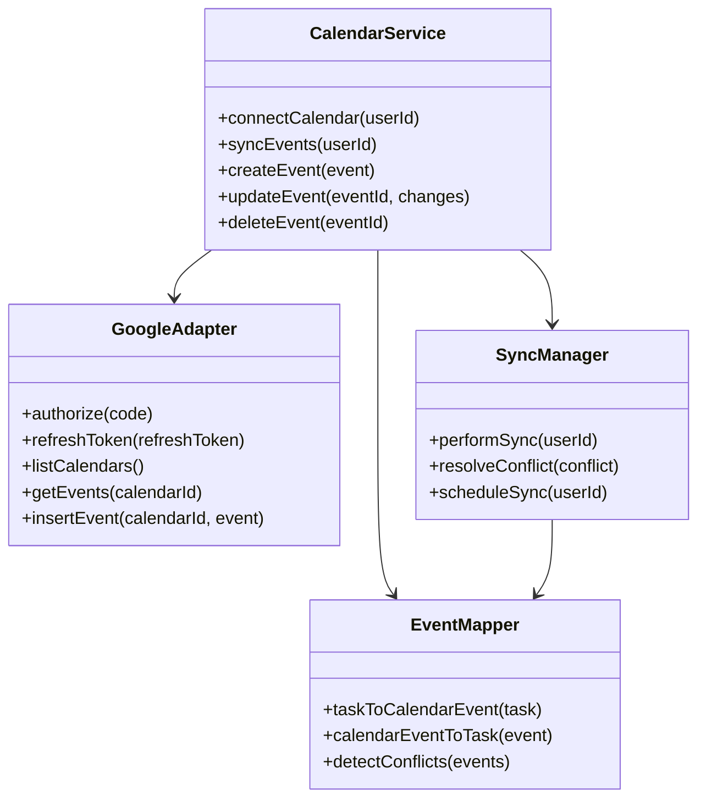
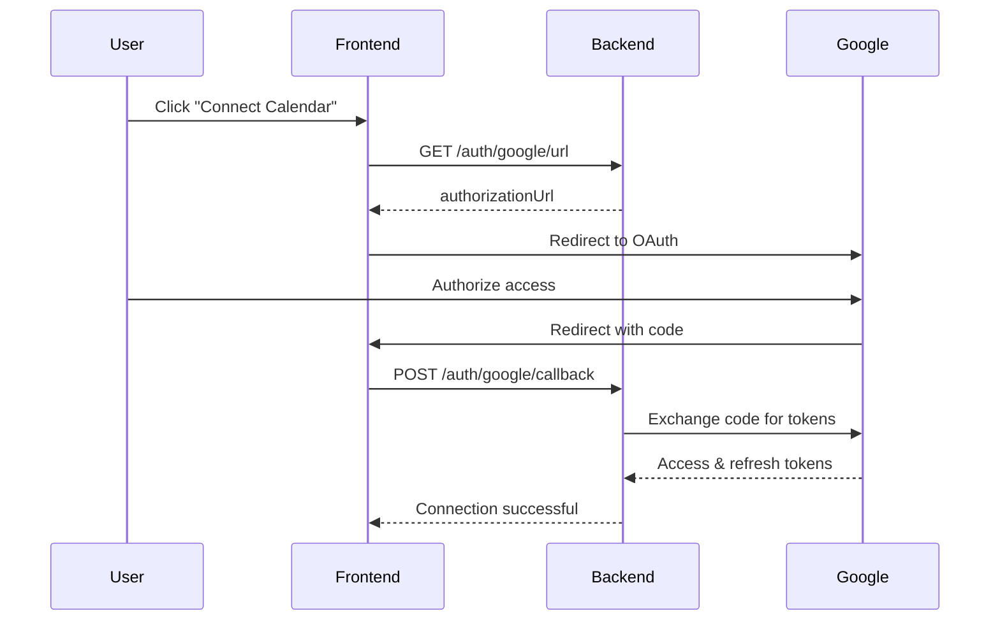
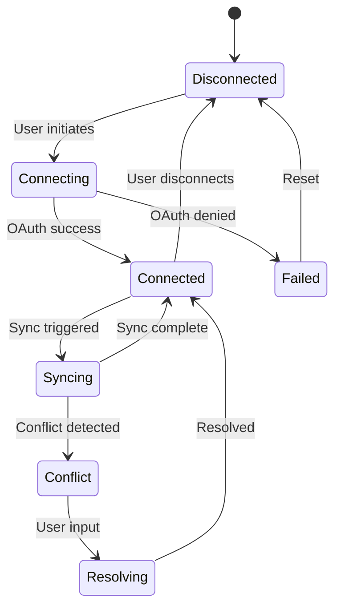

# Google Calendar Integration - Technical Specification

## 1. Background

### Problem Statement
ShareHouse members use multiple calendar systems and miss important house events. There's no sync between ShareHouse tasks/chores and members' personal calendars, leading to scheduling conflicts and forgotten responsibilities.

### Context / History
- Members manually copy tasks to their calendars
- No visibility of house events in personal workflow
- Scheduling conflicts between personal and house commitments
- Different members use different calendar systems

### Stakeholders
- ShareHouse members (calendar users)
- ShareHouse admins
- Google Calendar API
- Other calendar providers (future)

## 2. Motivation

### Goals & Success Stories

**User Goals:**
- "As a member, I want my chores to appear in my Google Calendar"
- "As a member, I want to see when guests are arriving in my calendar"
- "As an admin, I want house events synced to all members' calendars"

**Technical Functionality:**
- Two-way sync between ShareHouse and Google Calendar
- Automatic event creation for tasks and chores
- Calendar-based reminders
- Conflict detection

## 3. Scope and Approaches

### Non-Goals

| Technical Functionality | Reasoning for being off scope |
|------------------------|-------------------------------|
| Other calendar providers initially | Focus on Google first |
| Calendar-based task creation | Keep task creation in app |
| Private event sync | Only house-related events |
| Historical data sync | Only sync future events |

### Value Proposition

| Technical Functionality | Value | Tradeoffs |
|------------------------|-------|-----------|
| OAuth integration | Secure access to calendars | Complex setup flow |
| Two-way sync | Changes reflect everywhere | Conflict resolution complexity |
| Automatic event creation | No manual copying | API rate limits |
| Selective sync | User control over data | Configuration overhead |

### Alternative Approaches

| Technical Functionality | Pros | Cons |
|------------------------|------|------|
| iCal feed only | Simple, universal | One-way sync only |
| Manual export | User control | Extra steps required |
| Webhook notifications | Real-time updates | Requires calendar app support |
| Email invites | Works with all calendars | Not automatic |

### Relevant Metrics
- Calendar connection rate
- Sync frequency
- Event creation success rate
- User retention after connection
- Sync conflict rate

## 4. Step-by-Step Flow

### 4.1 Main ("Happy") Path - Connect and Sync Calendar

**Pre-condition:** User has Google account and is ShareHouse member

1. User clicks "Connect Google Calendar" in settings
2. System redirects to Google OAuth consent screen
3. User authorizes calendar access
4. System receives OAuth tokens
5. System fetches user's calendar list
6. User selects calendar for sync
7. System creates ShareHouse calendar or uses selected
8. System syncs existing future tasks to calendar
9. System sets up webhook for real-time sync

**Post-condition:** Calendar connected and syncing bidirectionally

### 4.2 Alternate / Error Paths

| # | Condition | System Action | Suggested Handling |
|---|-----------|---------------|-------------------|
| A1 | OAuth denied | Show error | Explain permissions needed |
| A2 | API quota exceeded | Queue sync | Retry with backoff |
| A3 | Calendar deleted | Detect on sync | Prompt reconnection |
| A4 | Token expired | Refresh token | Auto-refresh silently |
| A5 | Conflict detected | Show options | User chooses resolution |

## 5. UML Diagrams

### Calendar Integration Architecture

### OAuth Flow

### Sync State Machine

## 5. Edge Cases and Concessions

### Edge Cases
- User has multiple Google accounts
- Calendar has thousands of events
- Recurring tasks with exceptions
- Time zone differences
- All-day events vs. timed events

### Design Concessions
- Initial sync limited to 6 months future
- Maximum 100 events per sync cycle
- Only primary calendar initially (no shared calendars)
- No sync of private/personal details
- 15-minute minimum sync interval

## 6. Open Questions

1. Should we create a separate ShareHouse calendar or use primary?
2. How to handle recurring chores in calendar?
3. Should completed tasks be marked in calendar?
4. What calendar fields to populate (description, location, attendees)?
5. How to handle calendar notifications vs. app notifications?

## 7. Glossary / References

**Terms:**
- **OAuth 2.0:** Authorization framework for API access
- **Refresh Token:** Long-lived token for obtaining new access tokens
- **Calendar ID:** Unique identifier for Google Calendar
- **Event ID:** Unique identifier for calendar event
- **Webhook:** HTTP callback for real-time updates

**References:**
- [Google Calendar API](https://developers.google.com/calendar/api/v3/reference)
- [OAuth 2.0 for Google APIs](https://developers.google.com/identity/protocols/oauth2)
- [Calendar API Quotas](https://developers.google.com/calendar/api/v3/quotas)
- [iCalendar Specification](https://tools.ietf.org/html/rfc5545)