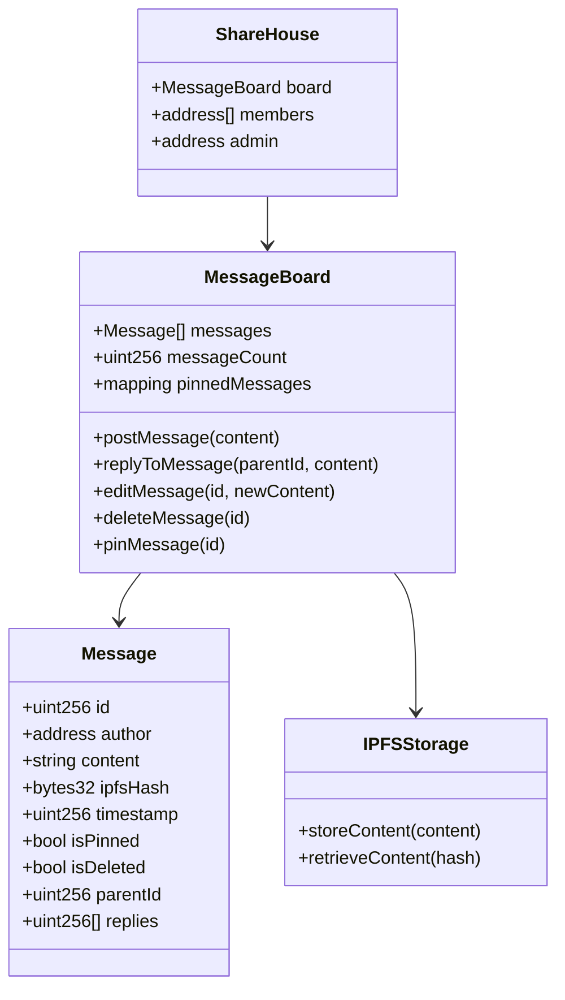
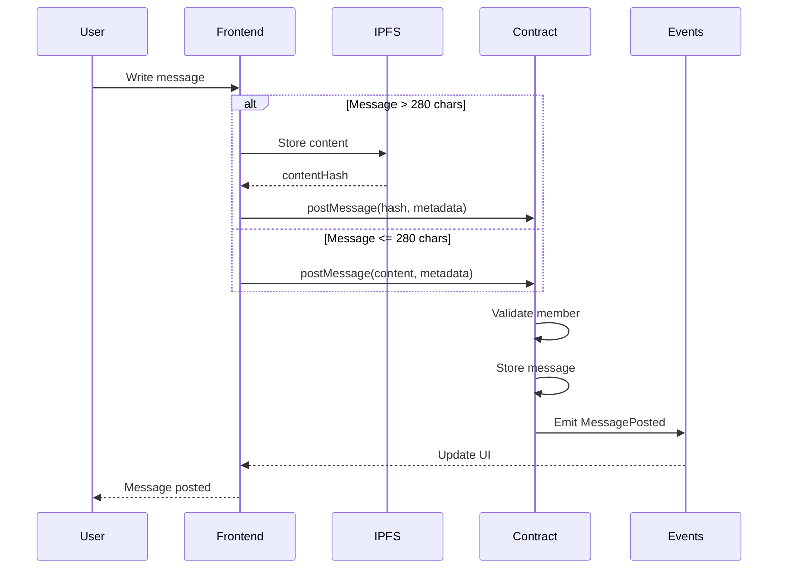
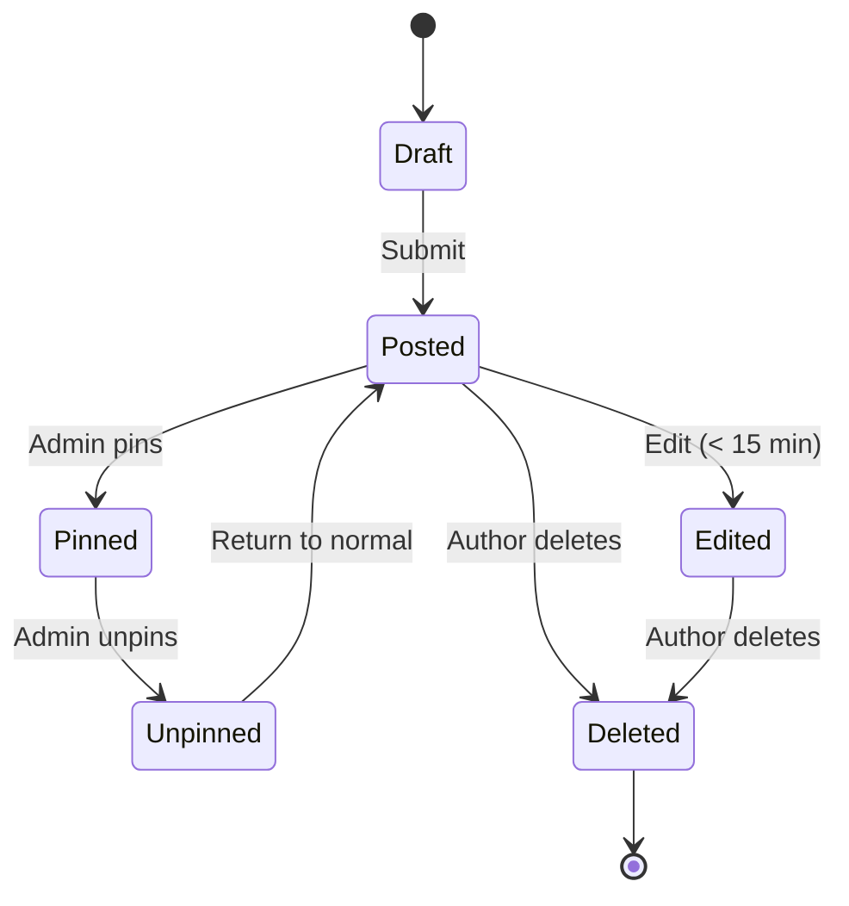

# ShareHouse Message Board - Technical Specification

## 1. Background

### Problem Statement
ShareHouse members lack a persistent, decentralized communication channel within the app. Important announcements, discussions, and decisions happen in external chat apps and are lost or forgotten. There's no permanent record of house communications or decisions.

### Context / History
- House communications fragmented across multiple platforms
- No audit trail of important discussions
- External chat apps don't integrate with house management
- Important messages get buried in chat history
- No way to pin or highlight critical information

### Stakeholders
- ShareHouse members (message authors and readers)
- ShareHouse creator/admin (moderator)
- Smart contract system
- Frontend application

## 2. Motivation

### Goals & Success Stories

**User Goals:**
- "As a member, I want to post announcements that won't get lost"
- "As a member, I want to have threaded discussions about house topics"
- "As an admin, I want to pin important messages for visibility"
- "As a house, we want a permanent record of our communications"

**Technical Functionality:**
- On-chain message storage
- Threaded conversations
- Message pinning and editing
- Decentralized, censorship-resistant communication

## 3. Scope and Approaches

### Non-Goals

| Technical Functionality | Reasoning for being off scope |
|------------------------|-------------------------------|
| Real-time chat | Not replacing chat apps |
| Private messaging | Focus on house-wide communication |
| Rich media (videos, audio) | Gas costs too high |
| Message encryption initially | Complexity for MVP |

### Value Proposition

| Technical Functionality | Value | Tradeoffs |
|------------------------|-------|-----------|
| On-chain storage | Permanent, immutable record | Gas costs per message |
| IPFS integration | Cheaper for long content | Additional complexity |
| Threaded replies | Organized discussions | More complex UI |
| Pin functionality | Highlight important info | Admin centralization |

### Alternative Approaches

| Technical Functionality | Pros | Cons |
|------------------------|------|------|
| Off-chain database | No gas costs | Centralized, not permanent |
| IPFS only | Decentralized, cheap | No smart contract integration |
| External forum | Feature-rich | Not integrated with app |
| No message board | Simpler | Miss communication needs |

### Relevant Metrics
- Messages posted per day
- Average message length
- Gas cost per message
- Thread depth
- Time to first reply
- Pinned message views

## 4. Step-by-Step Flow

### 4.1 Main ("Happy") Path - Post Message

**Pre-condition:** User is authenticated member of sharehouse

1. Member composes message in frontend
2. Frontend validates message length and content
3. If message > 280 chars, store in IPFS
4. Frontend calls smart contract with message/hash
5. Contract validates:
   - Sender is member
   - ShareHouse is active
   - Message format valid
6. Contract stores message with timestamp
7. Contract emits MessagePosted event
8. Frontend updates message board display
9. Other members see new message

**Post-condition:** Message permanently stored and visible to all members

### 4.2 Alternate / Error Paths

| # | Condition | System Action | Suggested Handling |
|---|-----------|---------------|-------------------|
| A1 | Message too long | Reject if no IPFS | Prompt to shorten |
| A2 | IPFS unavailable | Store hash only | Retry IPFS later |
| A3 | Not a member | Block posting | Show error |
| A4 | Edit after time limit | Prevent edit | Show deadline |
| A5 | Delete by non-author | Block action | Only author can delete |

## 5. UML Diagrams

### Message Board Architecture

### Message Posting Flow

### Message Lifecycle State Machine

## 5. Edge Cases and Concessions

### Edge Cases
- IPFS content becomes unavailable
- Message reply chains become too deep
- Bulk message posting (spam)
- Message board storage limits
- Concurrent edits to same message

### Design Concessions
- 15-minute edit window only
- Maximum message length (5000 chars in IPFS)
- No rich text formatting initially
- Maximum 3 pinned messages
- No message search functionality on-chain

## 6. Open Questions

1. Should messages be encrypted for privacy?
2. How deep should reply threads go?
3. Should we implement message reactions/voting?
4. How to handle message moderation?
5. Should deleted messages be hidden or marked?

## 7. Glossary / References

**Terms:**
- **IPFS:** InterPlanetary File System for decentralized storage
- **Content Hash:** Unique identifier for IPFS content
- **Thread:** Chain of messages replying to each other
- **Pinned Message:** Message highlighted at top of board

**References:**
- [IPFS Documentation](https://docs.ipfs.io/)
- [Solidity Events](https://docs.soliditylang.org/en/v0.8.0/contracts.html#events)
- [Gas Optimization Patterns](https://docs.soliditylang.org/en/v0.8.0/internals/optimizer.html)
- [EIP-2981: NFT Royalty Standard](https://eips.ethereum.org/EIPS/eip-2981) (for reference on metadata storage patterns)