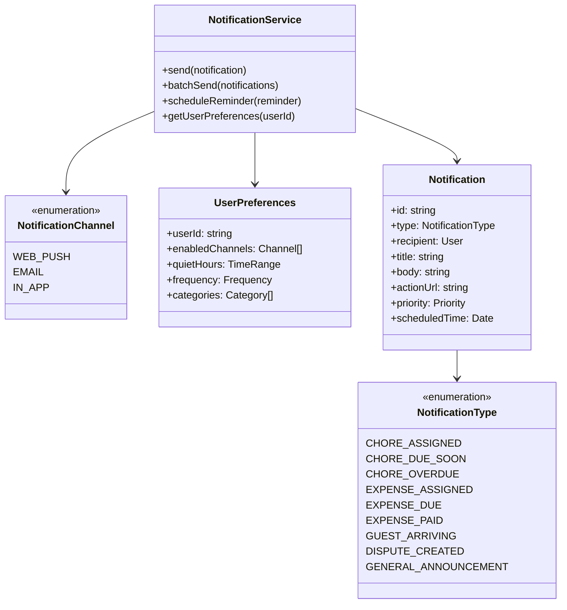
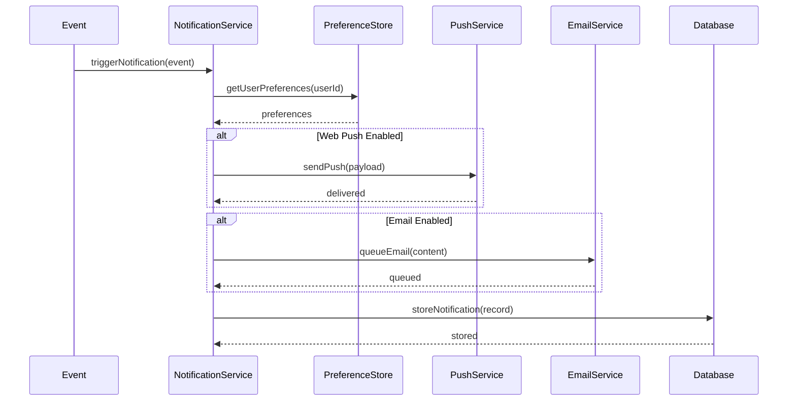
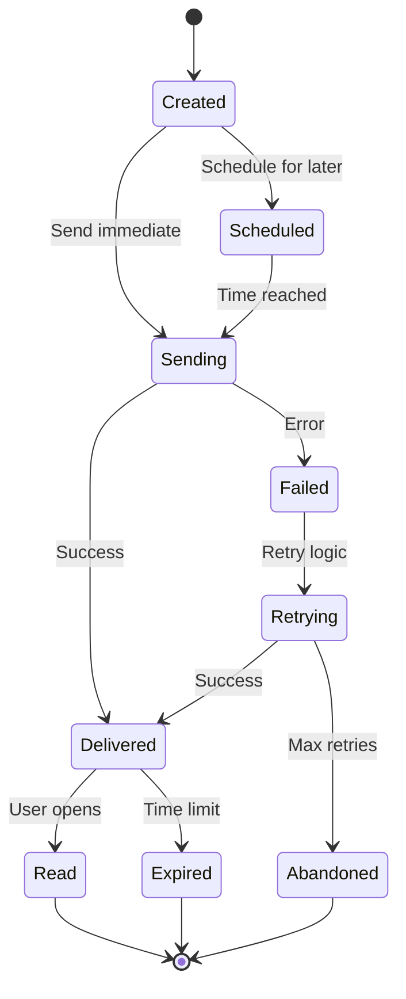

# ShareHouse Notifications System - Technical Specification

## 1. Background

### Problem Statement
ShareHouse members miss important updates about expenses and chores because they don't regularly check the app. This leads to overdue tasks, unpaid expenses, and general friction in house management. Members need proactive notifications for all house-related activities.

### Context / History
- Current system has no notification mechanism
- Members forget about assigned tasks and expenses
- No way to urgently communicate about house matters
- Missed deadlines cause house conflicts

### Stakeholders
- ShareHouse members (notification recipients)
- Task/expense assigners
- ShareHouse admins
- Notification service providers (web push, email)

## 2. Motivation

### Goals & Success Stories

**User Goals:**
- "As a member, I want to be notified when I'm assigned a new chore"
- "As a member, I want reminders before my tasks are due"
- "As an expense creator, I want to notify members about new shared costs"
- "As an admin, I want to ensure critical updates reach all members"

**Technical Functionality:**
- Multi-channel notifications (push, in-app, email)
- Configurable notification preferences
- Smart notification scheduling
- Real-time and batch notifications

## 3. Scope and Approaches

### Non-Goals

| Technical Functionality | Reasoning for being off scope |
|------------------------|-------------------------------|
| SMS notifications | Cost per message too high |
| Phone call alerts | Too intrusive for this use case |
| Desktop notifications | Focus on web/mobile first |
| Notification analytics | Phase 2 feature |

### Value Proposition

| Technical Functionality | Value | Tradeoffs |
|------------------------|-------|-----------|
| Web push notifications | Instant delivery, free | Requires user permission |
| In-app notification center | Always accessible | Only works when app is open |
| Email notifications | Universal reach | May go to spam |
| Batched notifications | Reduces notification fatigue | Less immediate |

### Alternative Approaches

| Technical Functionality | Pros | Cons |
|------------------------|------|------|
| Only in-app notifications | Simple implementation | Requires app to be open |
| Only email | Universal support | Low engagement rate |
| Real-time everything | Maximum immediacy | Notification overload |
| Daily digest only | Prevents fatigue | Not timely for urgent items |

### Relevant Metrics
- Notification delivery rate
- Click-through rate
- Time to task completion after notification
- User opt-out rate
- Notification preference changes

## 4. Step-by-Step Flow

### 4.1 Main ("Happy") Path - Chore Assignment Notification

**Pre-condition:** Member has notifications enabled and task is created

1. Admin assigns chore to member
2. System checks member's notification preferences
3. System queues notification for configured channels
4. For web push: Send immediate notification
5. For email: Add to batch queue (if configured)
6. For in-app: Create notification record
7. Member receives and clicks notification
8. System tracks engagement and marks as read

**Post-condition:** Member is aware of new chore assignment

### 4.2 Alternate / Error Paths

| # | Condition | System Action | Suggested Handling |
|---|-----------|---------------|-------------------|
| A1 | Push permission denied | Fall back to email | Prompt to enable later |
| A2 | Email bounces | Mark email invalid | Request email update |
| A3 | User unsubscribes | Honor preference | Show in-app only |
| A4 | Service quota exceeded | Queue for retry | Batch remaining |
| A5 | Duplicate notification | Deduplicate | Skip sending |

## 5. UML Diagrams

### Notification System Architecture

### Notification Flow

### Notification State Machine

## 5. Edge Cases and Concessions

### Edge Cases
- User changes preferences during batch processing
- Multiple notifications for same event
- Notification sent as member is removed
- Time zone differences for scheduled notifications
- Device token expiration for push notifications

### Design Concessions
- Maximum 10 notifications per day per user (prevent spam)
- Email batching mandatory for non-urgent items
- No notification history beyond 30 days
- Cannot customize notification text initially
- Quiet hours apply globally (not per notification type)

## 6. Open Questions

1. Should we implement notification grouping/threading?
2. How to handle notification preferences for new categories?
3. Should admins be able to force notifications?
4. What's the retry strategy for failed notifications?
5. Should we support notification actions (quick reply, mark complete)?

## 7. Glossary / References

**Terms:**
- **Web Push:** Browser-based push notifications
- **Service Worker:** Background script for push handling
- **FCM:** Firebase Cloud Messaging
- **Quiet Hours:** Time periods when notifications are suppressed
- **Notification Fatigue:** User overwhelm from too many notifications

**References:**
- [Web Push Protocol](https://developers.google.com/web/fundamentals/push-notifications)
- [Firebase Cloud Messaging](https://firebase.google.com/docs/cloud-messaging)
- [Email Best Practices](https://sendgrid.com/blog/email-best-practices/)
- [Notification UX Guidelines](https://developer.apple.com/design/human-interface-guidelines/notifications)