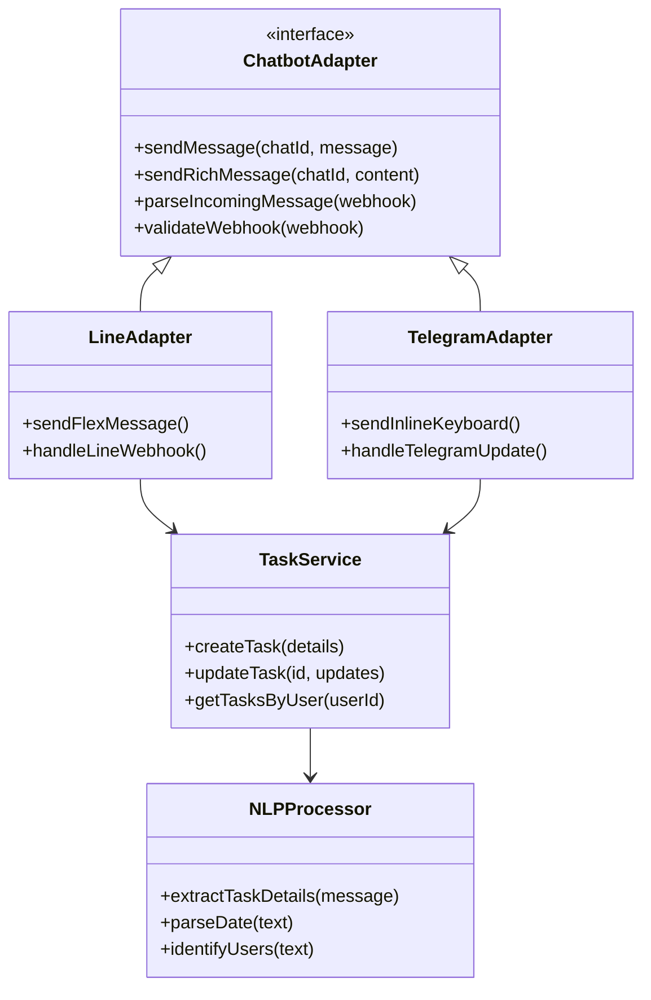
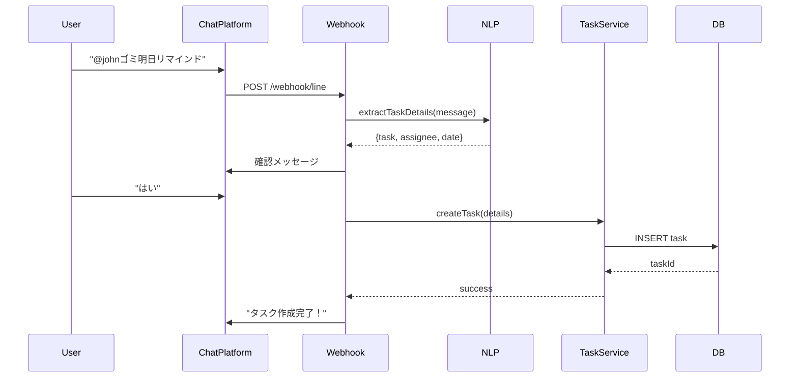
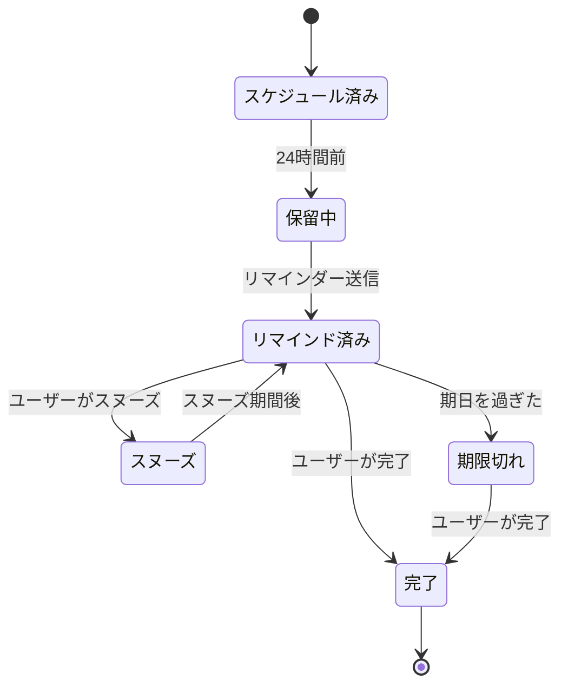

# タスク管理とリマインダーのためのチャットボット統合 - 技術仕様書

## 1. 背景

### 問題の概要
ShareHouseのメンバーは現在、タスクの割り当て、リマインダー、更新情報を確認するために手動でアプリをチェックする必要があります。これによりタスク管理に摩擦が生じ、プラットフォームへのエンゲージメントが低下しています。メンバーは定期的にアプリを開かないため、重要な期限や更新を見逃してしまいます。

### コンテキスト / 経緯
- ほとんどのシェアハウスはすでに日常的なコミュニケーションにグループチャットプラットフォーム（LINE、WhatsApp、Telegram）を使用しています
- 現在のシステムでは、チャットアプリとShareHouseアプリを切り替える必要があります
- アプリ外での自動リマインダーや通知がありません

### ステークホルダー
- ShareHouseメンバー（主要ユーザー）
- ShareHouseクリエイター/管理者
- 外部チャットプラットフォーム（LINE、Telegram、Discord、Slack、WhatsApp）
- バックエンド通知サービス

## 2. 動機

### 目標と成功事例

**ユーザー目標:**
- 「シェアハウスのメンバーとして、アプリを開かずにグループチャットからタスクを作成したい」
- 「シェアハウスのメンバーとして、グループチャットで家事のリマインダーを受け取りたい」
- 「シェアハウスの管理者として、期限切れのタスクについてボットが自動的にメンバーに通知してほしい」

**技術的機能:**
- チャットプラットフォームとShareHouseアプリ間の双方向同期
- タスク作成のための自然言語処理
- 自動リマインダーシステム
- プラットフォーム非依存アーキテクチャ

## 3. スコープとアプローチ

### 非目標

| 技術的機能 | スコープ外の理由 |
|-----------|----------------|
| 音声/ビデオチャット統合 | テキストベースのタスク管理に焦点を当てる |
| ユーザー間のダイレクトメッセージ | グループコミュニケーションに焦点を維持 |
| AIによるタスク自動割り当て | 手動割り当てが説明責任を維持 |
| リアルタイムチャットの置き換え | ShareHouseはチャットアプリではない |

### 価値提案

| 技術的機能 | 価値 | トレードオフ |
|-----------|------|------------|
| 自然言語処理 | コマンドを学習せずに簡単にタスク作成 | 意図の誤解釈の可能性 |
| マルチプラットフォームサポート | 既存のチャットアプリで動作 | 複数のアダプターを維持する複雑さ |
| 自動リマインダー | タスク完了率の向上 | 通知疲れの可能性 |
| インタラクティブボタン | タイピング不要のクイックアクション | プラットフォーム固有の実装が必要 |

### 代替アプローチ

| 技術的機能 | 長所 | 短所 |
|-----------|------|------|
| プッシュ通知のみ | シンプルな実装 | ユーザーはまだアプリを開く必要がある |
| メールリマインダー | ユニバーサルサポート | チャットより低いエンゲージメント |
| SMS通知 | 高い配信率 | メッセージごとのコスト |
| アプリ内メッセージングのみ | UXの完全な制御 | アプリが開いている必要がある |

### 関連メトリクス
- チャットボット経由のタスク作成率
- リマインダー後のタスク完了率
- ボットコマンドへの応答時間
- インタラクティブメッセージへのユーザーエンゲージメント

## 4. ステップバイステップフロー

### 4.1 メイン（「ハッピー」）パス - チャット経由のタスク作成

**前提条件:** ユーザーが認証済みで、シェアハウスがチャットプラットフォームに接続されている

1. ユーザーがメッセージを送信: 「ボット、@johnに明日ゴミ出しをするようリマインド」
2. ボットが検証:
   - ユーザーがシェアハウスのメンバーである
   - @johnが有効なメンバーである
   - 「明日」が解析可能な日付である
3. ボットが解析された詳細を含む確認メッセージを作成
4. ユーザーが「はい」で確認
5. システムがデータベースにタスクを作成
6. ボットがタスクの詳細を含む成功メッセージを送信

**事後条件:** タスクが作成され、期日と共に@johnに割り当てられる

### 4.2 代替/エラーパス

| # | 条件 | システムアクション | 推奨される処理 |
|---|-----|------------------|--------------|
| A1 | 不明なユーザーが言及された | エラーメッセージを返す | 利用可能なユーザーを提案 |
| A2 | 無効な日付形式 | 明確化を要求 | 日付形式の例を表示 |
| A3 | シェアハウスが接続されていない | 403 Forbidden | 管理者にチャット接続を促す |
| A4 | レート制限超過 | 429 Too Many Requests | 後で処理するためにキューに入れる |
| A5 | チャットプラットフォームAPIダウン | 503 Service Unavailable | 指数バックオフで再試行 |

## 5. UML図

### システムアーキテクチャ

### タスク作成フロー

### リマインダーステートマシン

## 5. エッジケースと妥協点

### エッジケース
- 似た名前の複数のユーザー（@john vs @johnny）
- チャットプラットフォームとアプリ間のタイムゾーンの違い
- 高ボリューム時のメッセージ順序
- 編集/削除されたメッセージの処理
- グループチャットからボットが削除される

### 設計上の妥協点
- 初期バージョンは英語のみサポート
- 複雑な繰り返しタスクはアプリで作成する必要がある
- ファイル添付（画像、ドキュメント）は初期段階ではサポートされない
- スパムを防ぐためシェアハウスあたり1日最大100タスク

## 6. 未解決の質問

1. ボットは個性/トーンを持つべきか、それとも中立的であるべきか？
2. ボットがすべてのグループメッセージにアクセスできる場合のプライバシーの扱い方は？
3. 機密データのエンドツーエンド暗号化を実装すべきか？
4. NLPがメッセージの解析に失敗した場合のフォールバックは？
5. 異なるチャットプラットフォーム間でユーザーを認証する方法は？

## 7. 用語集 / 参考文献

**用語:**
- **アダプター:** チャット統合のプラットフォーム固有の実装
- **Webhook:** チャットプラットフォームからメッセージを受信するHTTPエンドポイント
- **NLP:** ユーザーの意図を理解するための自然言語処理
- **リッチメッセージ:** プラットフォーム固有のインタラクティブメッセージ形式
- **フレックスメッセージ:** LINEの柔軟なメッセージテンプレートシステム
- **インラインキーボード:** Telegramのインタラクティブボタンシステム

**参考文献:**
- [LINE Messaging APIドキュメント](https://developers.line.biz/ja/docs/messaging-api/)
- [Telegram Bot API](https://core.telegram.org/bots/api)
- [Discord開発者ポータル](https://discord.com/developers/docs)
- [Slack APIドキュメント](https://api.slack.com/)
- [WhatsApp Business API](https://developers.facebook.com/docs/whatsapp)