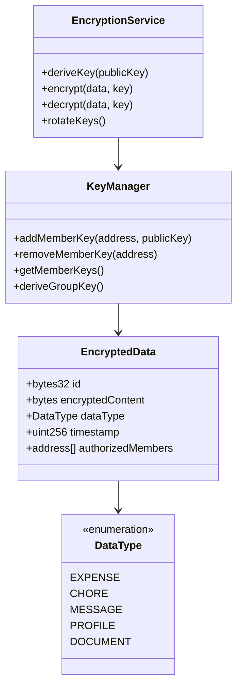
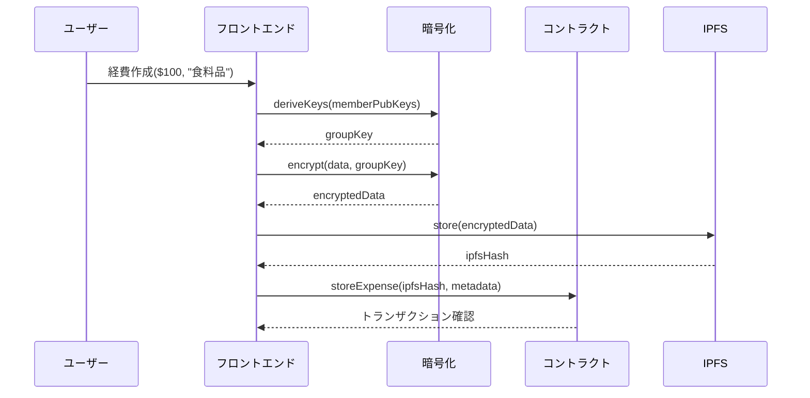
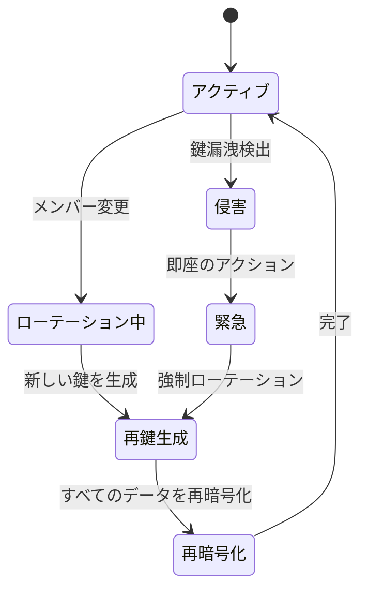

# ShareHouseデータ暗号化システム - 技術仕様書

## 1. 背景

### 問題の概要
ShareHouseのデータ（経費、家事、メッセージ、個人情報）は現在、ブロックチェーン上に平文で保存されており、プライバシーの懸念を生じさせています。メンバーの財務情報、スケジュール、個人的な習慣は、ブロックチェーンを調べる誰にでも公開されています。

### コンテキスト / 経緯
- すべてのシェアハウスデータは現在オンチェーン上で暗号化されていません
- メンバーは経費の金額と説明のプライバシーを懸念しています
- 家事の割り当てが個人のスケジュールを明らかにします
- メッセージボードの内容が永続的に公開されています
- プライバシー規制（GDPRなど）に準拠する方法がありません

### ステークホルダー
- ShareHouseメンバー（データ所有者）
- ShareHouse管理者
- スマートコントラクトシステム
- 規制コンプライアンスチーム
- 外部監査人

## 2. 動機

### 目標と成功事例

**ユーザー目標:**
- 「メンバーとして、私の経費データを非メンバーからプライベートにしたい」
- 「シェアハウスとして、内部コミュニケーションを機密のままにしたい」
- 「管理者として、透明性を維持しながらメンバーのプライバシーを保護したい」

**技術的機能:**
- 機密データのエンドツーエンド暗号化
- ECDSA公開鍵を使用した鍵管理
- 承認されたメンバーのための選択的復号化
- データを明らかにせずに検証するためのゼロ知識証明

## 3. スコープとアプローチ

### 非目標

| 技術的機能 | スコープ外の理由 |
|-----------|----------------|
| 準同型暗号化 | モバイルには計算コストが高すぎる |
| マルチパーティ計算 | 複雑さが利点を上回る |
| オフチェーンストレージ暗号化のみ | オンチェーンのプライバシーも必要 |
| 暗号化されたスマートコントラクトロジック | まずデータ暗号化に焦点を当てる |

### 価値提案

| 技術的機能 | 価値 | トレードオフ |
|-----------|------|------------|
| ECIES暗号化 | すべてのシェアハウスデータのプライバシー | ガスコスト増加 |
| ウォレットからの鍵導出 | 追加の鍵管理不要 | ウォレットの侵害が暗号化に影響 |
| 選択的暗号化 | プライバシーと透明性のバランス | 設定の複雑さ |
| メンバーベースのアクセス制御 | データはハウス内でプライベート | メンバー変更時の鍵ローテーション |

### 代替アプローチ

| 技術的機能 | 長所 | 短所 |
|-----------|------|------|
| オフチェーンストレージのみ | 低ガスコスト | 中央集権的ストレージへの信頼 |
| 対称暗号化 | シンプルな実装 | 鍵配布問題 |
| 暗号化なし | 最もシンプルで安価 | プライバシーなし |
| ハイブリッドオン/オフチェーン | コストとプライバシーのバランス | 複雑さの増加 |

### 関連メトリクス
- 暗号化/復号化パフォーマンス（ms）
- トランザクションあたりの追加ガスコスト
- 鍵ローテーション頻度
- データ侵害インシデント
- 復号化失敗率

## 4. ステップバイステップフロー

### 4.1 メイン（「ハッピー」）パス - 暗号化された経費の作成

**前提条件:** メンバーがウォレットを接続し、シェアハウスの一員である

1. メンバーが金額と説明を含む経費を作成
2. フロントエンドがメンバーのウォレットから暗号化キーを導出
3. システムがシェアハウスの公開鍵を使用してデータを暗号化
4. 暗号化されたデータがスマートコントラクトに送信される
5. スマートコントラクトが暗号化されたブロブとメタデータを保存
6. 他のメンバーが自分のキーを使用してフェッチおよび復号化
7. 復号化されたデータがフロントエンドに表示される

**事後条件:** 経費が暗号化されて保存され、メンバーのみが表示可能

### 4.2 代替/エラーパス

| # | 条件 | システムアクション | 推奨される処理 |
|---|-----|------------------|--------------|
| A1 | メンバーウォレット利用不可 | 暗号化できない | ローカルに保存、後で暗号化 |
| A2 | 復号化失敗 | エラーを表示 | 再暗号化を要求 |
| A3 | 新メンバー追加 | すべてのデータを再暗号化 | オフピーク時にバッチ処理 |
| A4 | メンバー削除 | 鍵をローテーション | 即座に鍵ローテーション |
| A5 | 鍵の侵害検出 | 緊急ローテーション | 全メンバーに通知 |

## 5. UML図

### 暗号化アーキテクチャ

### 暗号化フロー

### 鍵ローテーションステートマシン

## 5. エッジケースと妥協点

### エッジケース
- メンバーがウォレットへのアクセスを失う
- バッチデータの部分的な復号化
- スマートコントラクトアップグレード中の暗号化
- クロスデバイス鍵同期
- 大きなファイル（画像、ドキュメント）の処理

### 設計上の妥協点
- 初期バージョンは新しいデータのみ暗号化（遡及的ではない）
- すべてのメンバー間で共有されるグループキー（個別暗号化ではない）
- プライバシーの利益のためパフォーマンスへの影響を受け入れる
- 復号化せずに暗号化されたデータを検索できない
- 緊急回復には過半数のメンバー承認が必要

## 6. 未解決の質問

1. 管理者アクションにしきい値暗号化を使用すべきか？
2. 退去メンバーのデータエクスポートをどのように処理するか？
3. 暗号化はシェアハウスごとに必須またはオプションであるべきか？
4. コンプライアンスのため暗号化されたデータをどのように監査するか？
5. バックアップキー回復メカニズムは？

## 7. 用語集 / 参考文献

**用語:**
- **ECIES:** 楕円曲線統合暗号化方式
- **鍵導出:** ECDSA鍵から暗号化鍵を生成
- **グループキー:** すべてのシェアハウスメンバーの共有鍵
- **ゼロ知識証明:** データを明らかにせずにデータの有効性を証明
- **鍵ローテーション:** 暗号化鍵を定期的に変更

**参考文献:**
- [ECIES仕様](https://en.wikipedia.org/wiki/Integrated_Encryption_Scheme)
- [イーサリアムECIES実装](https://github.com/ethereum/py-evm/blob/master/eth/tools/ecies.py)
- [NuCypherプロキシ再暗号化](https://www.nucypher.com/)
- [IPFS暗号化](https://docs.ipfs.io/concepts/privacy-and-encryption/)