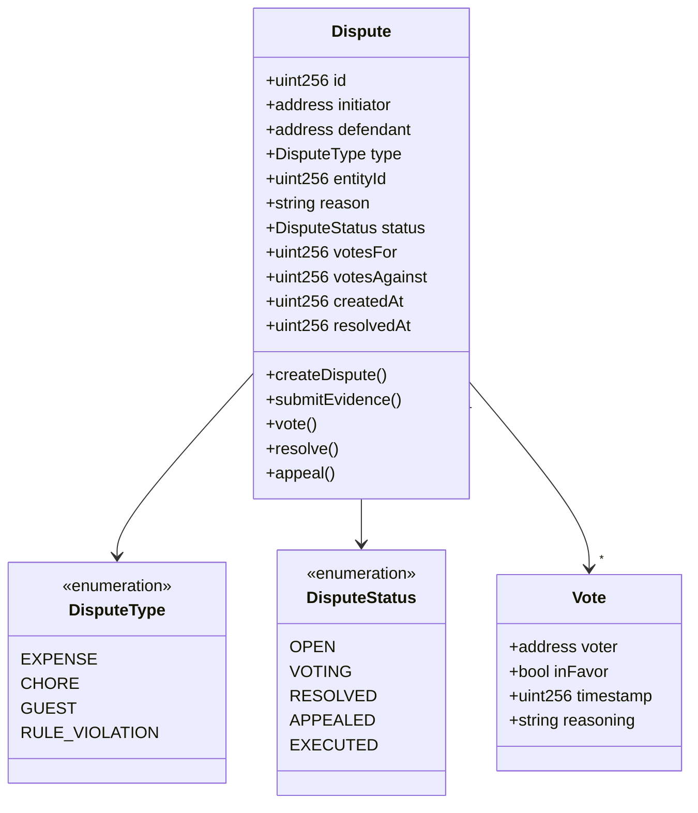
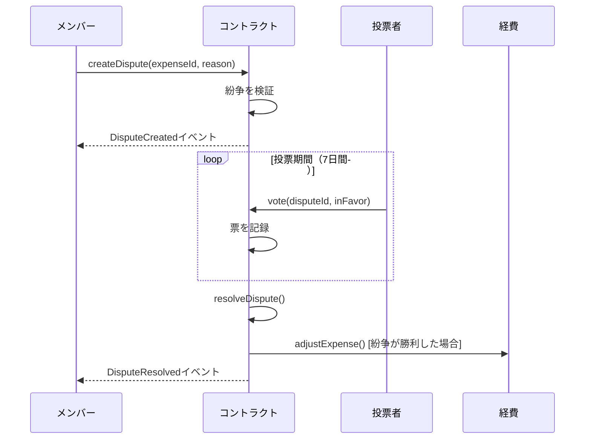
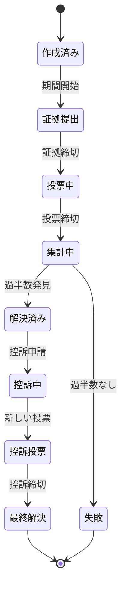

# 紛争解決システム - 技術仕様書

## 1. 背景

### 問題の概要
ShareHouseのメンバーは、経費、家事、ハウスルールに関する紛争を解決するための透明で公正なメカニズムを欠いています。現在の紛争はチャットや対面での議論を通じて非公式に処理され、未解決の緊張状態とメンバーの退去につながっています。

### コンテキスト / 経緯
- 紛争は一般的に経費の不一致、未完了の家事、ルール違反から発生します
- 紛争や解決の正式な記録がありません
- 説明責任や執行メカニズムがありません
- 以前の試みはしばしば開催されないハウスミーティングに依存していました

### ステークホルダー
- ShareHouseメンバー（紛争当事者）
- ShareHouseクリエイター/管理者
- スマートコントラクトシステム
- その他のハウスメンバー（投票者）

## 2. 動機

### 目標と成功事例

**ユーザー目標:**
- 「メンバーとして、不当な経費請求に正式に異議を申し立てたい」
- 「ハウスとして、民主的な紛争解決を求めています」
- 「管理者として、すべての紛争と結果の透明な記録が欲しい」

**技術的機能:**
- オンチェーンの改ざん防止紛争記録
- 民主的投票メカニズム
- 自動解決実行
- 公正性のための控訴プロセス

## 3. スコープとアプローチ

### 非目標

| 技術的機能 | スコープ外の理由 |
|-----------|----------------|
| 法的仲裁 | 法的プラットフォームではない |
| 経費を超えた金銭的補償 | ハウス問題に範囲を維持 |
| 外部調停者の関与 | ハウスの自治を維持 |
| 匿名の紛争 | 信頼のため透明性が重要 |

### 価値提案

| 技術的機能 | 価値 | トレードオフ |
|-----------|------|------------|
| オンチェーン記録 | 改ざん防止履歴 | 操作のガスコスト |
| 民主的投票 | 公正な解決 | バイアス/連合の可能性 |
| 自動実行 | 人間の執行負担を排除 | スマートコントラクトの複雑さ |
| 控訴メカニズム | 公正性のための二度目のチャンス | 解決時間の延長 |

### 代替アプローチ

| 技術的機能 | 長所 | 短所 |
|-----------|------|------|
| オフチェーン仲裁 | ガスコストなし | 執行メカニズムなし |
| 管理者のみの決定 | 迅速な解決 | 権力乱用の可能性 |
| 第三者調停者 | プロフェッショナルな対応 | 追加コストと複雑さ |
| 評判システムのみ | 社会的圧力 | 具体的な執行なし |

### 関連メトリクス
- 平均紛争解決時間
- 控訴された紛争の割合
- 結果に対するメンバーの満足度
- シェアハウスごとの紛争頻度

## 4. ステップバイステップフロー

### 4.1 メイン（「ハッピー」）パス - 経費紛争解決

**前提条件:** メンバーが経費の割り当てが不正確だと考えている

1. メンバーが理由を付けて経費IDに対して紛争を開始
2. システムが検証:
   - メンバーがシェアハウスの一員である
   - 経費が存在し、メンバーが関与している
   - 同じ経費に対する既存の紛争がない
3. システムが7日間の投票期間で紛争を作成
4. 被告が反証を提供
5. ハウスメンバーが投票（関係者を除く）
6. 投票期間後、システムが票を集計
7. 紛争が勝利した場合（>50%の票）、経費が再割り当て/調整される
8. システムが自動的に解決を実行

**事後条件:** 投票結果に従って経費が調整される

### 4.2 代替/エラーパス

| # | 条件 | システムアクション | 推奨される処理 |
|---|-----|------------------|--------------|
| A1 | 投票者不足 | 投票期間を延長 | 全メンバーに通知 |
| A2 | 同票 | 紛争失敗 | 現状維持 |
| A3 | 紛争中にメンバーが退去 | 残りのメンバーで継続 | 定足数を調整 |
| A4 | 控訴要求 | 控訴プロセス開始 | 1回の控訴許可 |
| A5 | スマートコントラクト一時停止 | 後でキューに入れる | 管理者通知 |

## 5. UML図

### 紛争データモデル

### 紛争解決フロー

### 紛争ステートマシン

## 5. エッジケースと妥協点

### エッジケース
- メンバーが同じ問題に対して複数の紛争を作成
- メンバー削除直前に紛争が作成される
- アクティブな紛争中のスマートコントラクトアップグレード
- 一時的なメンバーによる投票操作
- 紛争システム自体についての紛争

### 設計上の妥協点
- 無限ループを防ぐため紛争あたり最大1回の控訴
- 複雑な投票ウェイトではなく単純過半数（>50%）
- 7日間の固定投票期間（初期設定では構成不可）
- 説明責任を確保するため匿名投票なし
- 30日以上前の紛争に異議を申し立てることはできない

## 6. 未解決の質問

1. 投票権は在籍期間やステークで重み付けされるべきか？
2. ハウスに2〜3人のメンバーしかいない場合の紛争処理方法は？
3. 軽微な紛争を申し立てることにペナルティがあるべきか？
4. 紛争は開始者によって撤回できるか？
5. 解決まで投票を秘密にすべきか？

## 7. 用語集 / 参考文献

**用語:**
- **定足数:** 有効性のために必要な最小投票数
- **控訴:** 解決された紛争に対する二度目の投票要求
- **エンティティ:** 紛争の対象となるアイテム（経費、家事など）
- **解決:** 紛争からの結果とアクション
- **証拠:** 紛争申し立てを裏付ける文書

**参考文献:**
- [Aragon Court](https://court.aragon.org/) - 分散型紛争解決
- [Kleros](https://kleros.io/) - ブロックチェーン紛争解決プロトコル
- [OpenZeppelinガバナンス](https://docs.openzeppelin.com/contracts/4.x/governance) - 投票メカニズム