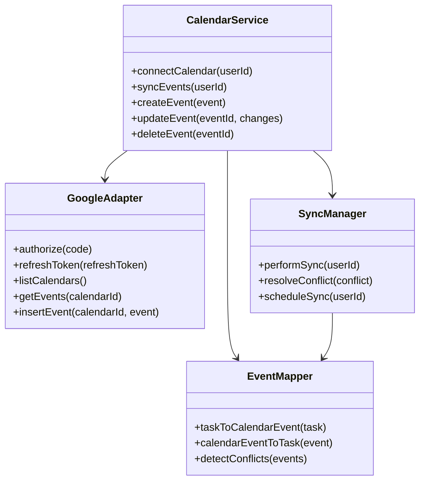
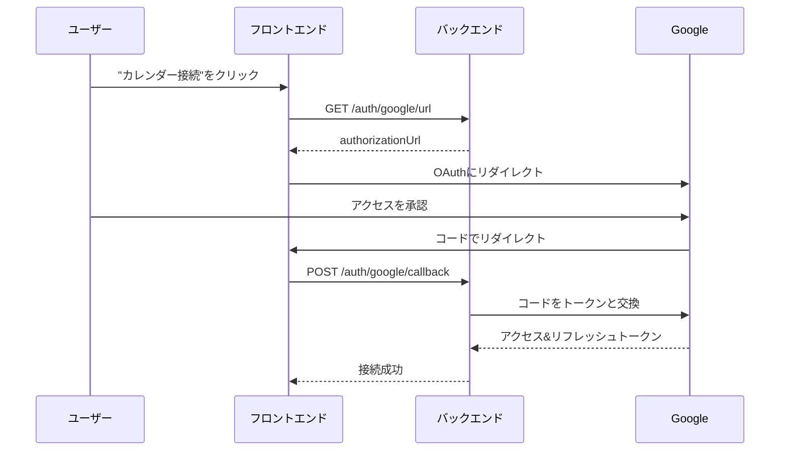
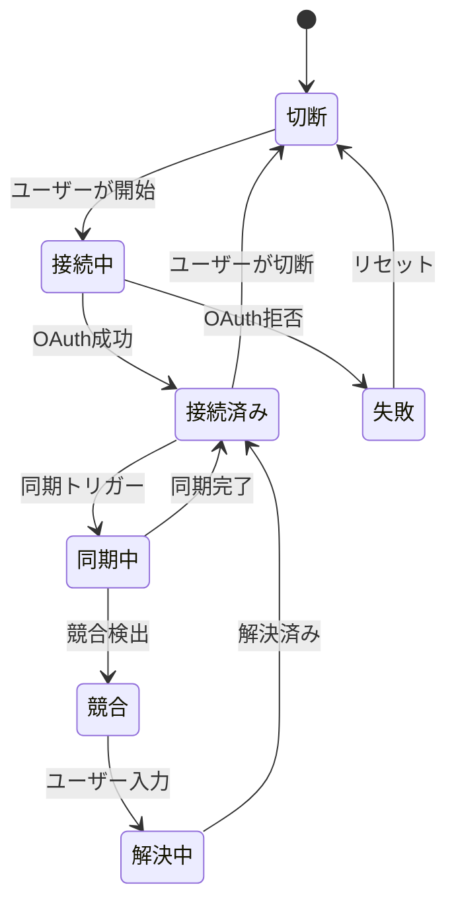

# Googleカレンダー統合 - 技術仕様書

## 1. 背景

### 問題の概要
ShareHouseのメンバーは複数のカレンダーシステムを使用しており、重要なハウスイベントを見逃しています。ShareHouseのタスク/家事とメンバーの個人カレンダー間の同期がなく、スケジュールの競合と責任の忘却につながっています。

### コンテキスト / 経緯
- メンバーは手動でタスクをカレンダーにコピーしています
- 個人のワークフローでハウスイベントの可視性がありません
- 個人とハウスのコミットメント間のスケジュール競合
- 異なるメンバーが異なるカレンダーシステムを使用

### ステークホルダー
- ShareHouseメンバー（カレンダーユーザー）
- ShareHouse管理者
- Google Calendar API
- その他のカレンダープロバイダー（将来）

## 2. 動機

### 目標と成功事例

**ユーザー目標:**
- 「メンバーとして、家事がGoogleカレンダーに表示されるようにしたい」
- 「メンバーとして、ゲストがいつ到着するかをカレンダーで確認したい」
- 「管理者として、すべてのメンバーのカレンダーにハウスイベントを同期したい」

**技術的機能:**
- ShareHouseとGoogleカレンダー間の双方向同期
- タスクと家事の自動イベント作成
- カレンダーベースのリマインダー
- 競合検出

## 3. スコープとアプローチ

### 非目標

| 技術的機能 | スコープ外の理由 |
|-----------|----------------|
| 初期段階では他のカレンダープロバイダー | まずGoogleに焦点を当てる |
| カレンダーベースのタスク作成 | タスク作成はアプリ内に保持 |
| プライベートイベントの同期 | ハウス関連イベントのみ |
| 履歴データの同期 | 将来のイベントのみ同期 |

### 価値提案

| 技術的機能 | 価値 | トレードオフ |
|-----------|------|------------|
| OAuth統合 | カレンダーへの安全なアクセス | 複雑なセットアップフロー |
| 双方向同期 | どこでも変更が反映される | 競合解決の複雑さ |
| 自動イベント作成 | 手動コピー不要 | APIレート制限 |
| 選択的同期 | データのユーザー制御 | 構成のオーバーヘッド |

### 代替アプローチ

| 技術的機能 | 長所 | 短所 |
|-----------|------|------|
| iCalフィードのみ | シンプル、ユニバーサル | 一方向同期のみ |
| 手動エクスポート | ユーザー制御 | 追加ステップが必要 |
| Webhook通知 | リアルタイム更新 | カレンダーアプリのサポートが必要 |
| メール招待 | すべてのカレンダーで動作 | 自動ではない |

### 関連メトリクス
- カレンダー接続率
- 同期頻度
- イベント作成成功率
- 接続後のユーザー保持率
- 同期競合率

## 4. ステップバイステップフロー

### 4.1 メイン（「ハッピー」）パス - カレンダー接続と同期

**前提条件:** ユーザーがGoogleアカウントを持ち、ShareHouseメンバーである

1. ユーザーが設定で「Googleカレンダーを接続」をクリック
2. システムがGoogle OAuth同意画面にリダイレクト
3. ユーザーがカレンダーアクセスを承認
4. システムがOAuthトークンを受信
5. システムがユーザーのカレンダーリストを取得
6. ユーザーが同期用カレンダーを選択
7. システムがShareHouseカレンダーを作成または選択されたものを使用
8. システムが既存の将来のタスクをカレンダーに同期
9. システムがリアルタイム同期のためWebhookを設定

**事後条件:** カレンダーが接続され、双方向で同期中

### 4.2 代替/エラーパス

| # | 条件 | システムアクション | 推奨される処理 |
|---|-----|------------------|--------------|
| A1 | OAuth拒否 | エラーを表示 | 必要な権限を説明 |
| A2 | APIクォータ超過 | 同期をキュー | バックオフで再試行 |
| A3 | カレンダー削除 | 同期時に検出 | 再接続を促す |
| A4 | トークン期限切れ | トークンを更新 | サイレントに自動更新 |
| A5 | 競合検出 | オプションを表示 | ユーザーが解決を選択 |

## 5. UML図

### カレンダー統合アーキテクチャ

### OAuthフロー

### 同期ステートマシン

## 5. エッジケースと妥協点

### エッジケース
- ユーザーが複数のGoogleアカウントを持っている
- カレンダーに数千のイベントがある
- 例外のある繰り返しタスク
- タイムゾーンの違い
- 終日イベント対時間指定イベント

### 設計上の妥協点
- 初期同期は6ヶ月先まで制限
- 同期サイクルあたり最大100イベント
- 初期は主要カレンダーのみ（共有カレンダーなし）
- プライベート/個人の詳細の同期なし
- 最小15分の同期間隔

## 6. 未解決の質問

1. 別個のShareHouseカレンダーを作成すべきか、主要を使用すべきか？
2. カレンダーで繰り返し家事をどのように処理するか？
3. 完了したタスクをカレンダーでマークすべきか？
4. どのカレンダーフィールドを入力するか（説明、場所、出席者）？
5. カレンダー通知とアプリ通知をどのように処理するか？

## 7. 用語集 / 参考文献

**用語:**
- **OAuth 2.0:** APIアクセスのための認証フレームワーク
- **リフレッシュトークン:** 新しいアクセストークンを取得するための長期トークン
- **カレンダーID:** Googleカレンダーの一意の識別子
- **イベントID:** カレンダーイベントの一意の識別子
- **Webhook:** リアルタイム更新のHTTPコールバック

**参考文献:**
- [Google Calendar API](https://developers.google.com/calendar/api/v3/reference)
- [Google APIs用OAuth 2.0](https://developers.google.com/identity/protocols/oauth2)
- [Calendar APIクォータ](https://developers.google.com/calendar/api/v3/quotas)
- [iCalendar仕様](https://tools.ietf.org/html/rfc5545)