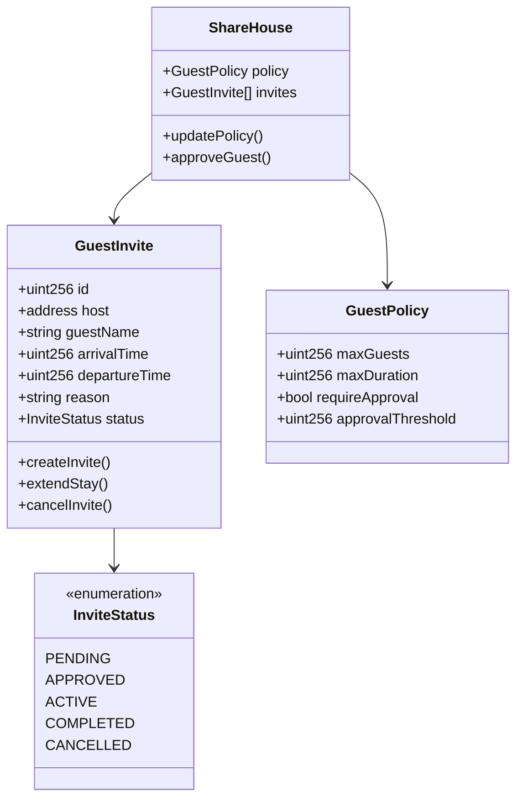
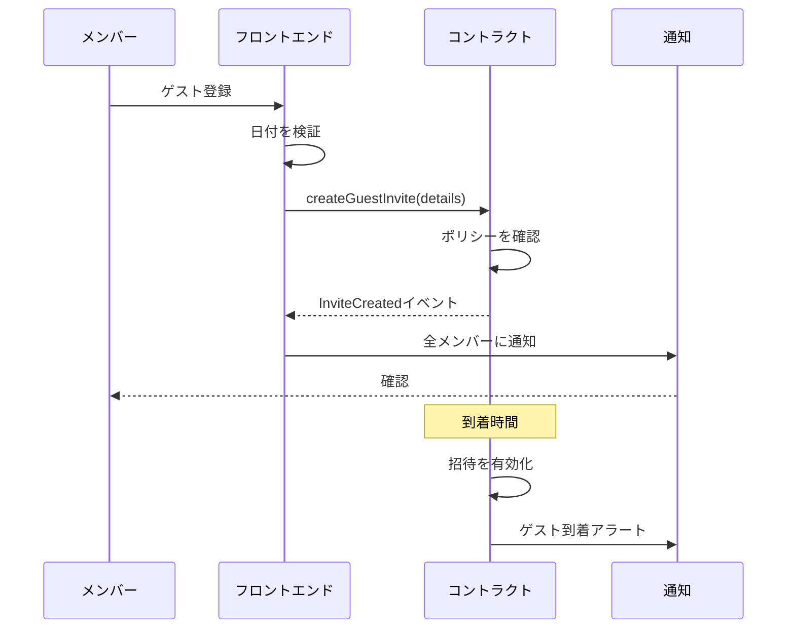
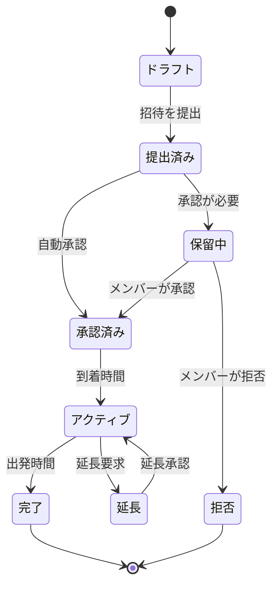

# ゲスト招待機能 - 技術仕様書

## 1. 背景

### 問題の概要
ShareHouseのメンバーはゲストの訪問を適切に追跡および管理できません。来訪するゲスト、その到着/出発時間、訪問者のハウスルールについてハウスメイトに通知するシステムがありません。これにより、驚き、セキュリティの懸念、ゲストポリシーに関する紛争が生じています。

### コンテキスト / 経緯
- メンバーは他の人に通知せずにゲストを連れてきます
- 誰がどのゲストを招待したかの記録がありません
- ゲストの滞在期間を追跡する方法がありません
- 不明な訪問者に関するセキュリティの懸念
- 宿泊ゲストについての紛争

### ステークホルダー
- ShareHouseメンバー（ホスト）
- ゲスト/訪問者
- ShareHouseクリエイター/管理者
- スマートコントラクトシステム

## 2. 動機

### 目標と成功事例

**ユーザー目標:**
- 「メンバーとして、ゲストがいるときにハウスメイトに通知したい」
- 「ハウスとして、誰がいつ訪問しているかを追跡したい」
- 「管理者として、ゲストポリシーを実施したい」
- 「メンバーとして、ゲストがいつ到着するかを知りたい」

**技術的機能:**
- オンチェーンゲスト登録
- 到着/出発タイムスタンプ
- ゲスト承認ワークフロー
- ゲストイベントの通知システム

## 3. スコープとアプローチ

### 非目標

| 技術的機能 | スコープ外の理由 |
|-----------|----------------|
| ゲストの身元確認 | プライバシーの懸念 |
| ゲスト支払いシステム | MVPの複雑さ |
| ゲストアクセス制御（物理的） | ハードウェア統合が必要 |
| 歴史的なゲスト分析 | 現在の追跡に焦点 |

### 価値提案

| 技術的機能 | 価値 | トレードオフ |
|-----------|------|------------|
| オンチェーンゲスト記録 | 透明、改ざん防止 | ガスコスト |
| 期間限定招待 | 明確な期待 | 積極的な管理が必要 |
| メンバー通知 | 全員が情報を保持 | 通知疲れの可能性 |
| 承認ワークフロー | 民主的な意思決定 | 遅いプロセス |

### 代替アプローチ

| 技術的機能 | 長所 | 短所 |
|-----------|------|------|
| オフチェーンゲストログ | ガスコストなし | 執行メカニズムなし |
| カレンダーのみの追跡 | シンプル | スマートコントラクト統合なし |
| 名誉システム | 技術不要 | 説明責任なし |
| 物理的なゲストブック | 伝統的なアプローチ | アプリに接続されていない |

### 関連メトリクス
- 平均ゲスト登録時間
- ゲストポリシー遵守率
- ゲスト紛争数
- ゲスト滞在期間精度
- ゲストシステムに対するメンバー満足度

## 4. ステップバイステップフロー

### 4.1 メイン（「ハッピー」）パス - ゲスト訪問の登録

**前提条件:** メンバーが認証済みでシェアハウスの一員である

1. メンバーがゲスト登録を開始
2. メンバーが提供:
   - ゲスト名/識別子
   - 到着日時
   - 出発日時
   - 訪問理由
3. システムが検証:
   - メンバーにゲスト権限がある
   - 日付が有効
   - ポリシー違反なし
4. システムがオンチェーンでゲストレコードを作成
5. システムがすべてのハウスメンバーに通知
6. 他のメンバーがゲスト詳細を表示可能
7. システムが到着前にリマインダーを送信
8. ゲスト期間が自動的に期限切れ

**事後条件:** ゲスト訪問が記録され、すべてのメンバーに通知

### 4.2 代替/エラーパス

| # | 条件 | システムアクション | 推奨される処理 |
|---|-----|------------------|--------------|
| A1 | ゲスト制限超過 | 登録を拒否 | 現在の制限を表示 |
| A2 | ゲストの重複 | 警告を表示 | 確認で許可 |
| A3 | 過去の到着日 | 送信を防ぐ | 将来の日付を要求 |
| A4 | メンバー未承認 | アクションをブロック | 管理者に連絡 |
| A5 | 延長滞在要求 | 承認が必要 | 投票メカニズム |

## 5. UML図

### ゲスト管理システム

### ゲスト登録フロー

### ゲスト招待ステートマシン

## 5. エッジケースと妥協点

### エッジケース
- ゲストが早く/遅く到着
- ゲストが通知なしに滞在を延長
- 緊急ゲスト状況
- 同じメンバーからの複数のゲスト
- メンバー不在中のゲスト

### 設計上の妥協点
- ゲストの身元確認なし（プライバシー）
- 最大30日間のゲスト期間
- 遡及的なゲスト登録なし
- シンプルな承認（複雑な投票なし）
- 物理的アクセスシステムとの統合なし

## 6. 未解決の質問

1. ゲストは一時的なアプリアクセスを持つべきか？
2. 繰り返しゲストをどのように処理するか？
3. ハウス全体のゲストカレンダーがあるべきか？
4. ゲストはホスト間で転送できるか？
5. ゲストの緊急事態をどのように処理するか？

## 7. 用語集 / 参考文献

**用語:**
- **ゲスト招待:** 計画されたゲスト訪問のオンチェーン記録
- **ホスト:** ゲストに責任を持つShareHouseメンバー
- **ゲストポリシー:** 訪問者に関するハウスルール
- **承認しきい値:** 承認に必要なメンバーの割合

**参考文献:**
- [スマートコントラクトイベント](https://docs.soliditylang.org/en/v0.8.0/contracts.html#events)
- [時間ベースのスマートコントラクト](https://docs.openzeppelin.com/contracts/4.x/api/utils#TimelockController)
- [アクセス制御パターン](https://docs.openzeppelin.com/contracts/4.x/access-control)