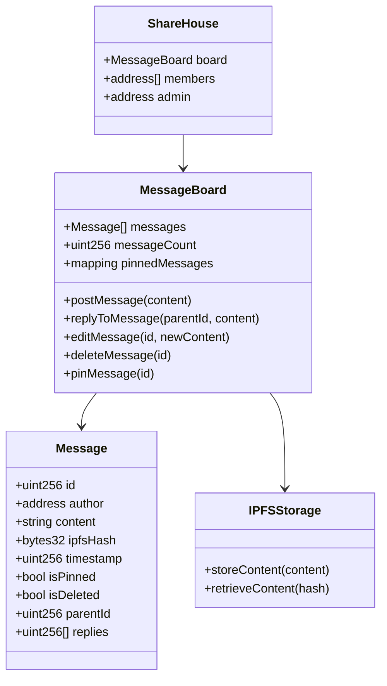
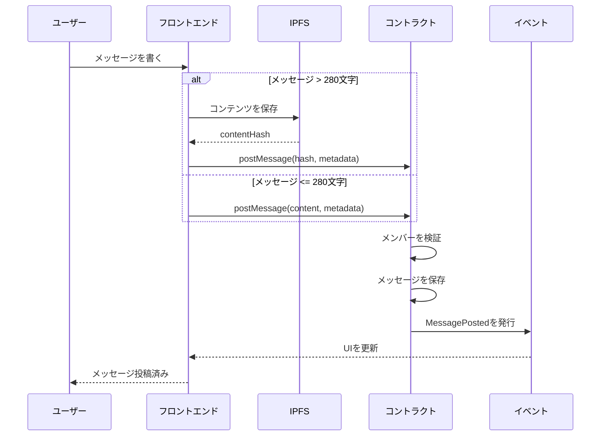
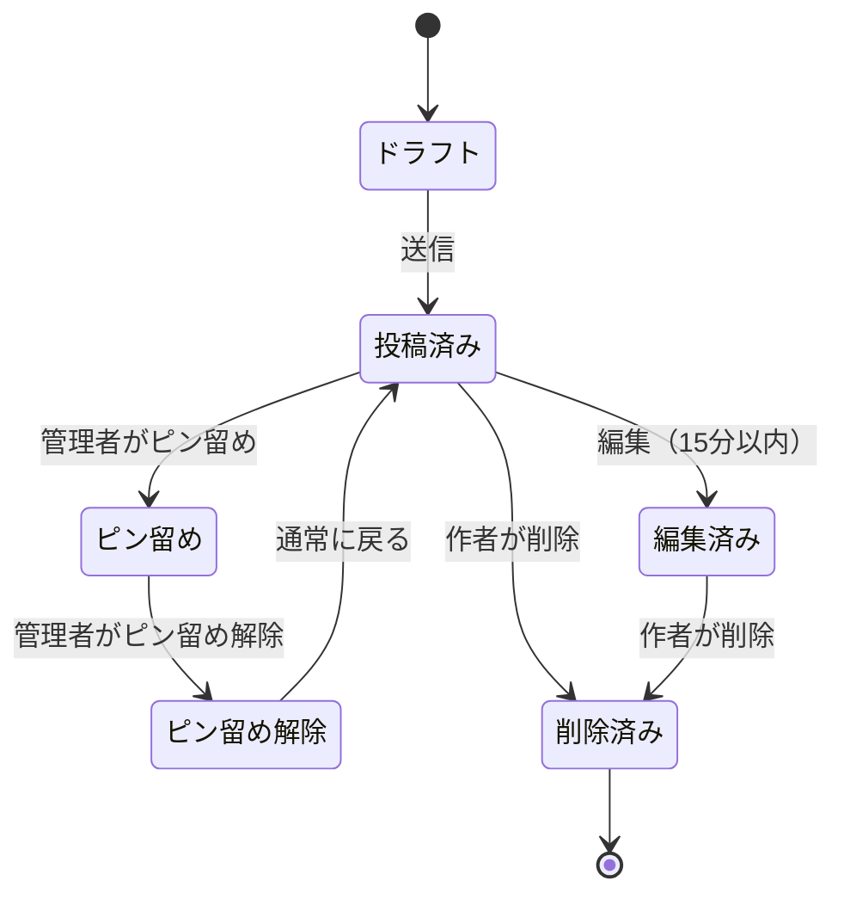

# ShareHouseメッセージボード - 技術仕様書

## 1. 背景

### 問題の概要
ShareHouseのメンバーは、アプリ内で永続的で分散化されたコミュニケーションチャネルを欠いています。重要な発表、議論、決定は外部チャットアプリで行われ、失われたり忘れられたりします。ハウスコミュニケーションや決定の永続的な記録がありません。

### コンテキスト / 経緯
- ハウスコミュニケーションが複数のプラットフォームに断片化
- 重要な議論の監査証跡なし
- 外部チャットアプリはハウス管理と統合されない
- 重要なメッセージがチャット履歴に埋もれる
- 重要な情報をピン留めまたはハイライトする方法なし

### ステークホルダー
- ShareHouseメンバー（メッセージ作者と読者）
- ShareHouseクリエイター/管理者（モデレーター）
- スマートコントラクトシステム
- フロントエンドアプリケーション

## 2. 動機

### 目標と成功事例

**ユーザー目標:**
- 「メンバーとして、失われない発表を投稿したい」
- 「メンバーとして、ハウストピックについてスレッド化された議論をしたい」
- 「管理者として、可視性のために重要なメッセージをピン留めしたい」
- 「ハウスとして、コミュニケーションの永続的な記録が欲しい」

**技術的機能:**
- オンチェーンメッセージストレージ
- スレッド化された会話
- メッセージのピン留めと編集
- 分散化された、検閲耐性のあるコミュニケーション

## 3. スコープとアプローチ

### 非目標

| 技術的機能 | スコープ外の理由 |
|-----------|----------------|
| リアルタイムチャット | チャットアプリを置き換えない |
| プライベートメッセージング | ハウス全体のコミュニケーションに焦点 |
| リッチメディア（ビデオ、オーディオ） | ガスコストが高すぎる |
| 初期段階でのメッセージ暗号化 | MVPの複雑さ |

### 価値提案

| 技術的機能 | 価値 | トレードオフ |
|-----------|------|------------|
| オンチェーンストレージ | 永続的、不変の記録 | メッセージあたりのガスコスト |
| IPFS統合 | 長いコンテンツに安価 | 追加の複雑さ |
| スレッド化返信 | 整理された議論 | より複雑なUI |
| ピン機能 | 重要な情報をハイライト | 管理者の中央集権化 |

### 代替アプローチ

| 技術的機能 | 長所 | 短所 |
|-----------|------|------|
| オフチェーンデータベース | ガスコストなし | 中央集権、永続的でない |
| IPFSのみ | 分散化、安価 | スマートコントラクト統合なし |
| 外部フォーラム | 機能豊富 | アプリと統合されない |
| メッセージボードなし | よりシンプル | コミュニケーションニーズを逃す |

### 関連メトリクス
- 1日あたりの投稿メッセージ数
- 平均メッセージ長
- メッセージあたりのガスコスト
- スレッド深度
- 最初の返信までの時間
- ピン留めメッセージビュー

## 4. ステップバイステップフロー

### 4.1 メイン（「ハッピー」）パス - メッセージ投稿

**前提条件:** ユーザーがシェアハウスの認証済みメンバーである

1. メンバーがフロントエンドでメッセージを作成
2. フロントエンドがメッセージ長とコンテンツを検証
3. メッセージが280文字を超える場合、IPFSに保存
4. フロントエンドがメッセージ/ハッシュでスマートコントラクトを呼び出す
5. コントラクトが検証:
   - 送信者がメンバーである
   - ShareHouseがアクティブ
   - メッセージ形式が有効
6. コントラクトがタイムスタンプでメッセージを保存
7. コントラクトがMessagePostedイベントを発行
8. フロントエンドがメッセージボード表示を更新
9. 他のメンバーが新しいメッセージを見る

**事後条件:** メッセージが永続的に保存され、すべてのメンバーに表示

### 4.2 代替/エラーパス

| # | 条件 | システムアクション | 推奨される処理 |
|---|-----|------------------|--------------|
| A1 | メッセージが長すぎる | IPFSなしで拒否 | 短縮を促す |
| A2 | IPFS利用不可 | ハッシュのみ保存 | 後でIPFSを再試行 |
| A3 | メンバーでない | 投稿をブロック | エラーを表示 |
| A4 | 時間制限後の編集 | 編集を防ぐ | 期限を表示 |
| A5 | 非作者による削除 | アクションをブロック | 作者のみ削除可能 |

## 5. UML図

### メッセージボードアーキテクチャ

### メッセージ投稿フロー

### メッセージライフサイクルステートマシン

## 5. エッジケースと妥協点

### エッジケース
- IPFSコンテンツが利用不可になる
- メッセージ返信チェーンが深くなりすぎる
- 大量メッセージ投稿（スパム）
- メッセージボードストレージ制限
- 同じメッセージへの同時編集

### 設計上の妥協点
- 15分の編集ウィンドウのみ
- 最大メッセージ長（IPFSで5000文字）
- 初期段階ではリッチテキスト形式なし
- 最大3つのピン留めメッセージ
- オンチェーンでメッセージ検索機能なし

## 6. 未解決の質問

1. プライバシーのためメッセージを暗号化すべきか？
2. 返信スレッドはどれくらい深くすべきか？
3. メッセージリアクション/投票を実装すべきか？
4. メッセージモデレーションをどのように処理するか？
5. 削除されたメッセージは非表示またはマークされるべきか？

## 7. 用語集 / 参考文献

**用語:**
- **IPFS:** 分散ストレージのためのインタープラネタリーファイルシステム
- **コンテンツハッシュ:** IPFSコンテンツの一意の識別子
- **スレッド:** 互いに返信するメッセージのチェーン
- **ピン留めメッセージ:** ボード上部にハイライトされたメッセージ

**参考文献:**
- [IPFSドキュメント](https://docs.ipfs.io/)
- [Solidityイベント](https://docs.soliditylang.org/en/v0.8.0/contracts.html#events)
- [ガス最適化パターン](https://docs.soliditylang.org/en/v0.8.0/internals/optimizer.html)
- [EIP-2981: NFTロイヤリティ標準](https://eips.ethereum.org/EIPS/eip-2981)（メタデータストレージパターンの参考）