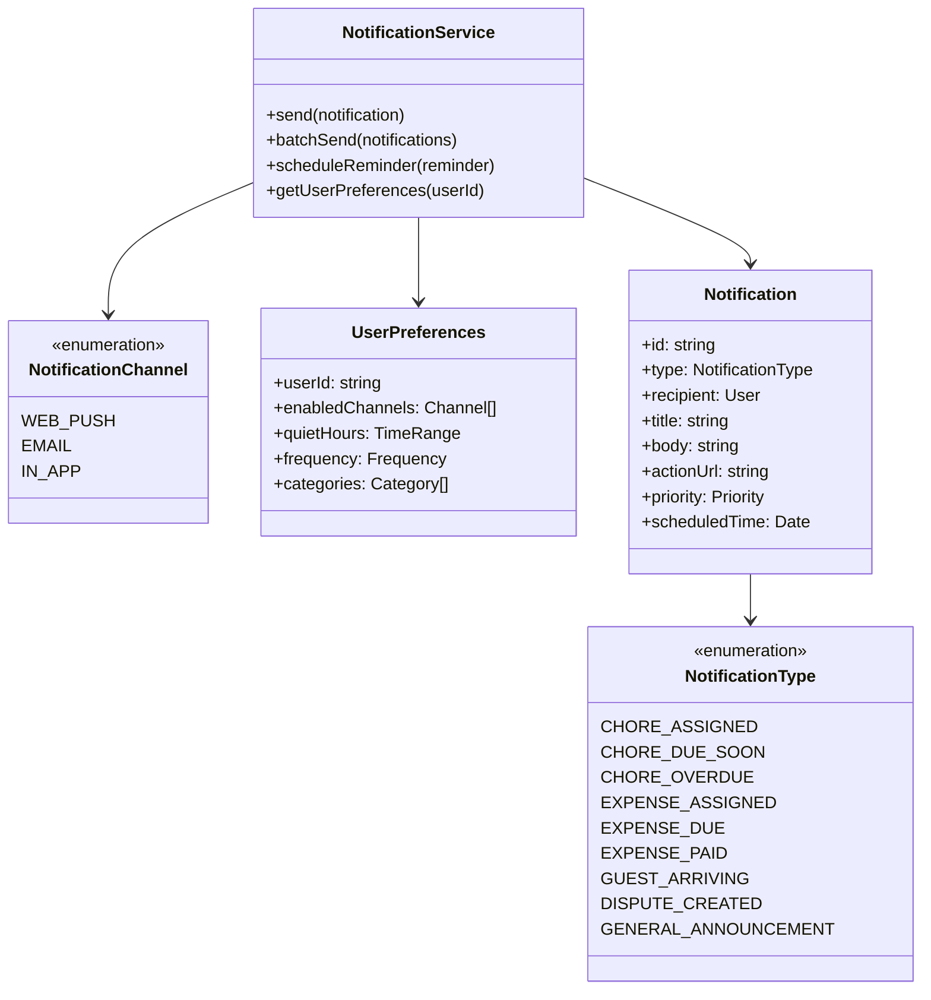
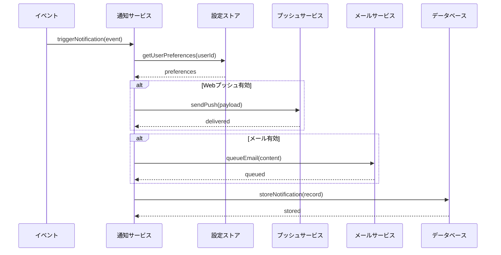
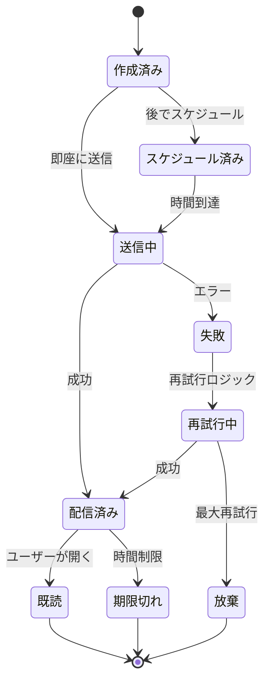

# ShareHouse通知システム - 技術仕様書

## 1. 背景

### 問題の概要
ShareHouseのメンバーは、定期的にアプリをチェックしないため、経費や家事に関する重要な更新を見逃しています。これにより、タスクの期限超過、未払いの経費、ハウス管理の一般的な摩擦が生じています。メンバーはすべてのハウス関連活動に対してプロアクティブな通知を必要としています。

### コンテキスト / 経緯
- 現在のシステムには通知メカニズムがありません
- メンバーは割り当てられたタスクと経費を忘れます
- ハウスの問題について緊急に連絡する方法がありません
- 期限を逃すことでハウスの紛争が発生します

### ステークホルダー
- ShareHouseメンバー（通知受信者）
- タスク/経費割り当て者
- ShareHouse管理者
- 通知サービスプロバイダー（Webプッシュ、メール）

## 2. 動機

### 目標と成功事例

**ユーザー目標:**
- 「メンバーとして、新しい家事が割り当てられたときに通知を受けたい」
- 「メンバーとして、タスクの期限前にリマインダーが欲しい」
- 「経費作成者として、新しい共有コストについてメンバーに通知したい」
- 「管理者として、重要な更新がすべてのメンバーに届くようにしたい」

**技術的機能:**
- マルチチャネル通知（プッシュ、アプリ内、メール）
- 設定可能な通知設定
- スマート通知スケジューリング
- リアルタイムおよびバッチ通知

## 3. スコープとアプローチ

### 非目標

| 技術的機能 | スコープ外の理由 |
|-----------|----------------|
| SMS通知 | メッセージごとのコストが高すぎる |
| 電話アラート | このユースケースには侵入的すぎる |
| デスクトップ通知 | Web/モバイルを最初に焦点を当てる |
| 通知分析 | フェーズ2の機能 |

### 価値提案

| 技術的機能 | 価値 | トレードオフ |
|-----------|------|------------|
| Webプッシュ通知 | 即座の配信、無料 | ユーザーの許可が必要 |
| アプリ内通知センター | 常にアクセス可能 | アプリが開いているときのみ動作 |
| メール通知 | ユニバーサルリーチ | スパムに入る可能性 |
| バッチ通知 | 通知疲れを軽減 | 即座性が低い |

### 代替アプローチ

| 技術的機能 | 長所 | 短所 |
|-----------|------|------|
| アプリ内通知のみ | シンプルな実装 | アプリを開く必要がある |
| メールのみ | ユニバーサルサポート | 低いエンゲージメント率 |
| すべてリアルタイム | 最大の即座性 | 通知過負荷 |
| 日次ダイジェストのみ | 疲労を防ぐ | 緊急項目にタイムリーでない |

### 関連メトリクス
- 通知配信率
- クリックスルー率
- 通知後のタスク完了までの時間
- ユーザーオプトアウト率
- 通知設定の変更

## 4. ステップバイステップフロー

### 4.1 メイン（「ハッピー」）パス - 家事割り当て通知

**前提条件:** メンバーが通知を有効にし、タスクが作成される

1. 管理者がメンバーに家事を割り当てる
2. システムがメンバーの通知設定を確認
3. システムが構成されたチャネルの通知をキューに入れる
4. Webプッシュの場合：即座に通知を送信
5. メールの場合：バッチキューに追加（構成されている場合）
6. アプリ内の場合：通知レコードを作成
7. メンバーが通知を受信してクリック
8. システムがエンゲージメントを追跡し、既読としてマーク

**事後条件:** メンバーが新しい家事の割り当てを認識

### 4.2 代替/エラーパス

| # | 条件 | システムアクション | 推奨される処理 |
|---|-----|------------------|--------------|
| A1 | プッシュ許可拒否 | メールにフォールバック | 後で有効化を促す |
| A2 | メールがバウンス | メール無効としてマーク | メール更新を要求 |
| A3 | ユーザーが購読解除 | 設定を尊重 | アプリ内のみ表示 |
| A4 | サービスクォータ超過 | 再試行のためキュー | 残りをバッチ |
| A5 | 重複通知 | 重複排除 | 送信をスキップ |

## 5. UML図

### 通知システムアーキテクチャ

### 通知フロー

### 通知ステートマシン

## 5. エッジケースと妥協点

### エッジケース
- バッチ処理中にユーザーが設定を変更
- 同じイベントに対する複数の通知
- メンバー削除時に通知が送信される
- スケジュール済み通知のタイムゾーンの違い
- プッシュ通知のデバイストークン期限切れ

### 設計上の妥協点
- ユーザーあたり1日最大10通知（スパム防止）
- 非緊急項目のメールバッチングは必須
- 30日を超える通知履歴なし
- 初期段階では通知テキストをカスタマイズできない
- 静かな時間はグローバルに適用（通知タイプごとではない）

## 6. 未解決の質問

1. 通知のグループ化/スレッド化を実装すべきか？
2. 新しいカテゴリの通知設定をどのように処理するか？
3. 管理者は通知を強制できるべきか？
4. 失敗した通知の再試行戦略は何か？
5. 通知アクション（クイック返信、完了マーク）をサポートすべきか？

## 7. 用語集 / 参考文献

**用語:**
- **Webプッシュ:** ブラウザベースのプッシュ通知
- **サービスワーカー:** プッシュ処理のためのバックグラウンドスクリプト
- **FCM:** Firebaseクラウドメッセージング
- **静かな時間:** 通知が抑制される時間帯
- **通知疲れ:** 多すぎる通知によるユーザーの過負荷

**参考文献:**
- [Webプッシュプロトコル](https://developers.google.com/web/fundamentals/push-notifications)
- [Firebase Cloud Messaging](https://firebase.google.com/docs/cloud-messaging)
- [メールベストプラクティス](https://sendgrid.com/blog/email-best-practices/)
- [通知UXガイドライン](https://developer.apple.com/design/human-interface-guidelines/notifications)